# THE NEXUS AUGMENTED INTELLIGENCE SYSTEM

Status: Active
Artifacts: New Artifact (Draft) (https://www.notion.so/New-Artifact-Draft-2e887cdcde0b80dfa32cf5c19367ce14?pvs=21)

## ARTIFACT BANK

## Diagrams: Interaction Matrix Visualizations

## Domain × Dimension Matrix

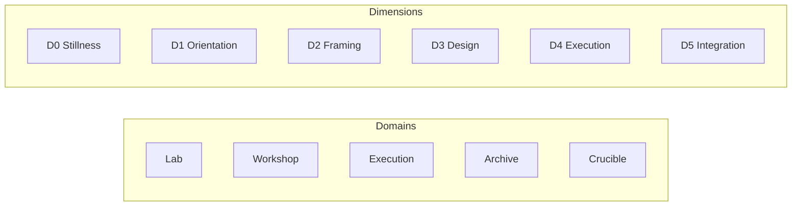

## Allowed Edges (green pathing) — bipartite graph

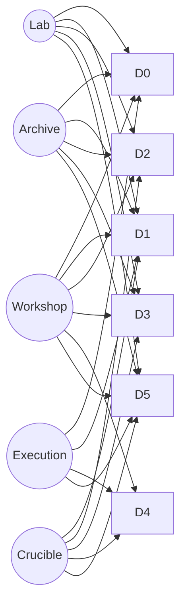

**Interpretation:**

- There is no arrow from **Lab → D4** (forbidden).
- Execution is narrow by design.

## Domain swimlanes (what each domain *permits*)

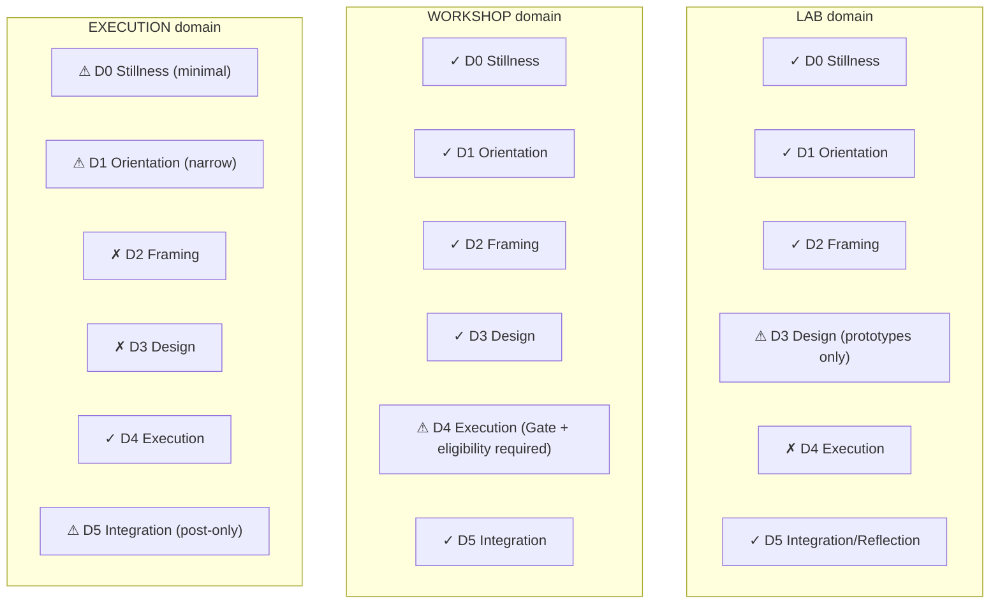

## Crucible + Gate overlay (two-key path)

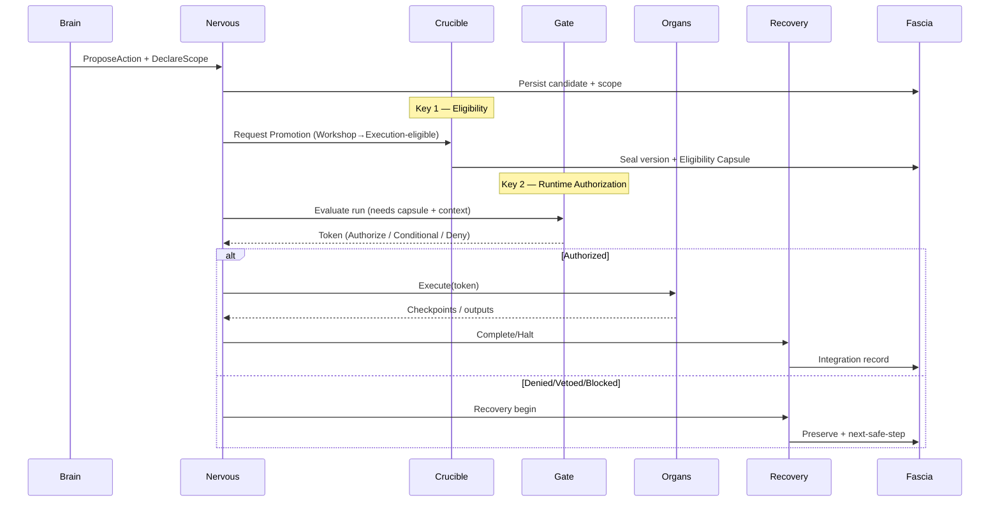

## Formal Crucible Protocol (CP-1)

### Explicit transformation without collapse or coercion

## Purpose of the Crucible

The **Crucible** is the system’s *only* legitimate mechanism for:

- granting authority
- promoting artifacts across domains
- binding identity or commitment
- enabling execution eligibility

It exists to prevent:

- premature execution
- hidden assumptions
- ego-locked artifacts
- “this feels ready so I acted” failures

**Core axiom**

> Nothing becomes executable, authoritative, or identity-binding unless it passes through the Crucible.
> 

## What the Crucible Is (and Is Not)

### The Crucible **is**

- a protocol
- an explicit transition
- a recorded decision
- a reversible constraint application

### The Crucible **is not**

- a place
- a review committee
- a vibe check
- a pressure mechanism

**Important:**

The Crucible does not decide *what* you want.

It decides whether something is allowed to **matter differently** afterward.

## Inputs to the Crucible

A Crucible invocation must include:

1. **Artifact Reference**
    - CN-ID or equivalent
    - current domain
    - version identifier
2. **Intended Promotion**
    - Lab → Workshop
    - Workshop → Execution
    - Draft → Canonical
    - Other (explicitly named)
3. **Scope Declaration**
    - what this will be allowed to affect
    - what it explicitly will *not* affect
4. **Assumption Set**
    - statements that must be true for this promotion to be safe
5. **Failure Surface**
    - what breaks if assumptions are wrong
    - who/what is affected
6. **Reversibility Assessment**
    - reversible | conditionally reversible | irreversible
7. **Recovery Plan**
    - what happens if this is rolled back
    - where context is preserved

If any input is missing, the Crucible **cannot proceed**.

## Crucible Phases

### Phase 1 — Declaration

- Promotion intent is stated
- No evaluation yet
- Purely descriptive

**Output:** `CrucibleIntentRecorded`

### Phase 2 — Constraint Imposition

The Crucible applies **constraints**, not approval:

- domain constraints (where this may operate)
- dimension constraints (resolution limits)
- authority constraints (what it can trigger)
- time constraints (expiry or review horizon)

**Key rule**

> Promotion always constrains.
> 
> 
> If something feels “freer” afterward, authority leaked.
> 

### Phase 3 — Heart Compatibility Check (Optional but Recommended)

- Does this violate any non-negotiable principles?
- If yes → Crucible halts with explanation
- If no → continue

Heart **cannot approve**, only block.

### Phase 4 — Gut Readiness Check (Optional but Recommended)

- Is the system ready to carry this promotion?
- If no → defer with explicit reassess condition
- If yes → continue

Gut **cannot approve**, only veto timing.

### Phase 5 — Seal

If all constraints are satisfied:

- artifact version is sealed
- promotion is recorded
- demotion path is guaranteed
- authority scope is frozen

**Output:** `CrucibleSealIssued`

## Crucible Outputs

A successful Crucible produces:

- `sealed_version_id`
- `bound_domain`
- `allowed_dimensions`
- `authority_scope`
- `reversibility_flag`
- `review_trigger` (optional)
- `demotion_procedure`

An unsuccessful Crucible produces:

- a **deferred state**, not rejection
- explicit missing requirements
- preserved context

## Demotion via Crucible

Demotion:

- uses the same protocol
- never deletes information
- removes authority
- preserves provenance

**Invariant**

> Demotion is lossless.
> 
> 
> Authority removal is not identity loss.
> 

## Crucible Failure Modes

| Failure | Result |
| --- | --- |
| Implicit promotion | Identity contamination |
| Missing reversibility | Panic lock-in |
| Skipped recovery plan | Context collapse |
| Emotional pressure | False readiness |
| Overuse of Crucible | Decision fatigue |

**Corrective principle**

> The Crucible should feel rare, deliberate, and relieving.
> 

## Validation Questions (Crucible)

- What changes *because* of this promotion?
- What remains explicitly unchanged?
- What happens if this turns out to be wrong?
- How do I undo this safely?
- Who or what is protected by saying “not yet”?

If these cannot be answered, the Crucible pauses.

## Crucible ↔ Execution Gate Unification Rules

### Two boundaries, two different jobs

**Core distinction (do not blur):**

- **Crucible** changes an artifact’s *ontological status* (draft → canonical, workshop-eligible → execution-eligible).
- **Execution Gate** issues *situational authorization* (token) for a specific run.

If you merge them conceptually, you get either:

- “everything is always executable” (danger), or
- “nothing ever executes” (stall).

### Unification Axioms

**U1 — Promotion ≠ Permission**

- Crucible can make something **eligible** for execution.
- Gate can make something **allowed now**.

**U2 — Gate cannot promote artifacts**

Gate can only authorize *instances*, not canonize *structures*.

**U3 — Crucible cannot issue runtime tokens**

Crucible seals versions; it never authorizes an actual run.

**U4 — Execution requires BOTH:**

1. artifact is **Execution-eligible** (Crucible result)
2. run is **Authorized** (Gate token)

**U5 — Conditions bind at the Gate, not at the Crucible**

- Crucible: “This can ever be executed, under these bounds.”
- Gate: “This execution is allowed now, under these conditions.”

**U6 — Demotion revokes eligibility; stop revokes tokens**

- Crucible demotion removes future authority.
- Stop/Recovery revokes current-run authority.

### Compatibility Contract (Data the Gate must receive from Crucible)

When an artifact is promoted to Execution-eligible, Crucible must produce an **Eligibility Capsule**:

- `sealed_version_id`
- `bound_domain = Execution`
- `allowed_dimensions = {D4 only, optional D5 post}`
- `authority_scope` (allowed organ classes, prohibited operations)
- `irreversibility_flag` (reversible / conditional / irreversible)
- `required_prereqs` (must be satisfied before Gate can authorize)
- `review_trigger` (expiry, drift threshold, or periodic re-seal rule)

**Gate input rule:**

> If the Eligibility Capsule is missing, the Gate must deny.
> 

### The Two-Key Rule

**Two-Key Authorization** is the clean mental model:

- **Key 1 (Crucible):** “This is allowed to exist as execution-eligible.”
- **Key 2 (Gate):** “This particular run is authorized now.”

No run proceeds with only one key.

### State Mapping: Where each boundary lives

**Crucible states** (meta-transition):

- Draft → Sealed (Workshop)
- Sealed (Workshop) → Execution-Eligible (Sealed + restricted)
- Any → Demoted (authority removed, provenance preserved)

**Gate states** (runtime transition):

- NotAuthorized → Authorized / AuthorizedWithConditions → Executing
- Any → Halted → Recovery

They are different state machines. They communicate via the Eligibility Capsule.

### Failure modes (and the rule that prevents them)

- **Failure:** Gate starts “approving” artifacts
    - **Prevented by:** U2
- **Failure:** Crucible becomes a runtime approval step every time
    - **Prevented by:** U3 + “Crucible is rare”
- **Failure:** Execution happens from Workshop without sealing
    - **Prevented by:** U4 + Gate deny on missing capsule
    

## Infrastructure Integration

## How Nervous, Endocrine, Immune integrate with Heart, Gut, Gate, Recovery

This section defines **interfaces, signal flows, and authority boundaries**.

Nothing here introduces new intelligence—only **wiring**.

---

## Integration Principles (Non-negotiable)

1. **No layer gains authority by integration**
2. **Signals do not equal decisions**
3. **All influence is visible**
4. **No silent correction**
5. **Recovery is mandatory, not implied**

These principles are enforced structurally, not culturally.

---

## System Roles (Condensed)

| System | Role | Authority |
| --- | --- | --- |
| Nervous System | Sequencing + interrupts + transport | None |
| Endocrine System | Slow modulation (load, pacing) | None |
| Immune System | Pattern detection + escalation | None |
| Heart | Normative constraint (values/principles) | Negative only |
| Gut | Readiness & safety veto | Negative only |
| Execution Gate | Authorization & irreversibility control | Positive (exclusive) |
| Organs | Bounded execution | Delegated |
| Recovery | Integration + stabilization | Mandatory |
| Fascia | Persistence + continuity | Canonical memory |

---

## Unified Signal Taxonomy

All infrastructure systems communicate via **typed signals**.

### 12.3.1 Signal Classes

- **Decision Requests** (enter evaluative layers)
- **Decision Results** (pass / veto / deny / authorize)
- **Modulation Signals** (advisory)
- **Interrupts** (preemptive)
- **Observations** (immune)
- **Lifecycle Events** (execution, recovery)
- **Persistence Events** (fascia writes)

---

## End-to-End Integrated Flow (Authoritative)

### Phase 1 — Proposal & Scoping

```
Brain → ProposeAction
Nervous → route
Fascia → persist candidate

```

```
Human / Brain → DeclareScope
Nervous → validate structure
Fascia → persist scope

```

**Endocrine:** passive (records baseline load)

**Immune:** passive

### Phase 2 — Normative Evaluation (Heart)

```
Nervous → HeartCheckRequested(scope)
Heart → {PASS | BLOCK | ESCALATE}

```

- Heart decision is **terminal or routing**, never authorizing.
- All outcomes are logged.

**Endocrine:** not consulted

**Immune:** observes frequency/patterns only

### Phase 3 — Readiness Evaluation (Gut)

```
Nervous → GutCheckRequested(scope, endocrine_snapshot)
Gut → {PASS | VETO}

```

- Endocrine supplies **load snapshot**
- Gut may veto based on readiness/safety

**Critical boundary:**

> Endocrine may influence Gut.
> 
> 
> Gut may veto Gate.
> 
> Endocrine may NOT veto directly.
> 

### Phase 4 — Authorization (Execution Gate)

```
Nervous → GateEvaluateRequested(scope, heart_result, gut_result, endocrine_snapshot)
Gate → {DENY | AUTHORIZE | AUTHORIZE_WITH_CONDITIONS}

```

Gate responsibilities:

- irreversibility check
- prerequisite enforcement
- condition construction
- token issuance

**Only here does execution become possible.**

### Phase 5 — Execution (Organs)

```
Nervous → StartExecution(token, plan)
Organs → perform bounded actions
Nervous → emit checkpoints

```

- Nervous enforces token scope
- Immune monitors patterns
- Endocrine accumulates cost signals

**Interrupts override everything.**

### Phase 6 — Recovery (Mandatory)

```
Terminal State → RecoveryBegin
Recovery → IntegrationRecord
Recovery → Load Update
Recovery → Return to Idle

```

- Gate tokens revoked
- Fascia updated
- Endocrine load updated
- Immune records outcome pattern

---

## Infrastructure Cross-Coupling (Explicit)

### 1. Endocrine → Others

| Target | Influence |
| --- | --- |
| Gut | readiness context |
| Gate | risk multiplier |
| Recovery | deactivation depth |
| Brain | planning realism |

**Never:** direct veto, authorization, or execution.

### 2. Immune → Others

| Target | Influence |
| --- | --- |
| Fascia | anomaly records |
| Brain | review prompts |
| Human | escalation visibility |

**Never:** blocking execution, rewriting decisions, auto-repair.

### 3. Nervous → Everyone

- routes signals
- enforces ordering
- propagates interrupts
- emits traces

**Never:** evaluates content.

---

## Global Interrupt Semantics (Hard Rules)

| Interrupt | Effect |
| --- | --- |
| StopRequested | Immediate halt + token revoke |
| CriticalError | Halt → Recovery |
| TokenRevoked | All organs cease |
| SafetyEscalation | Optional halt or checkpoint pause |

Interrupts **cannot be ignored, deferred, or softened**.

---

## Integrated State Guarantees

If this integration is respected, the system guarantees:

1. **No execution without authorization**
2. **No authorization without readiness**
3. **No readiness without context**
4. **No stopping without preservation**
5. **No success without integration**
6. **No drift without detection**

These are structural truths, not best practices.

---

## Failure Containment Matrix

| Failure | Contained By |
| --- | --- |
| Overdrive | Endocrine |
| Value violation | Heart |
| Unsafe timing | Gut |
| Premature action | Gate |
| Panic stop | Recovery |
| Slow drift | Immune |
| Context loss | Fascia |
| Coordination errors | Nervous |

No single failure can collapse the system.

---

## Validation Checklist (Integration)

- [ ]  Every decision produces a trace
- [ ]  Every terminal state enters Recovery
- [ ]  Endocrine never blocks directly
- [ ]  Immune never auto-fixes
- [ ]  Gate is the sole issuer of tokens
- [ ]  Stop always halts within one step
- [ ]  Recovery always returns to Idle

If all are true, the system is **internally coherent**.

---

## Summary

This integration achieves:

- **Power without coercion**
- **Safety without fragility**
- **Adaptation without drift**
- **Execution without collapse**

---

## Master Architecture Diagram

### How to read this diagram

- **Only the Gate authorizes execution** (highlighted)
- **Heart and Gut only constrain** — they never execute
- **Infrastructure surrounds, not replaces, cognition**
- **Recovery is mandatory and central**
- **Fascia is the only canonical memory**

If you can hold *this diagram* in mind, you can navigate the entire system without remembering details.

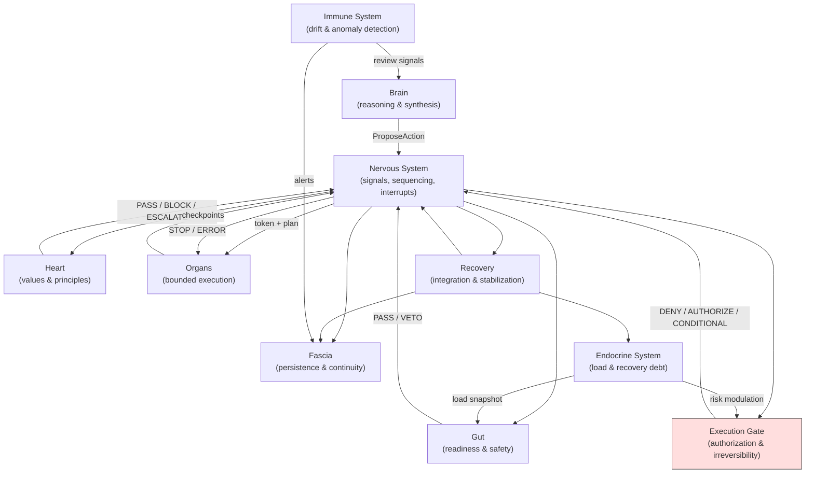

## Terminology & Glossary — Canonical Lock (v1)

## 0. Scope of This Glossary

- Applies to **all artifacts** (Paper, Spec, Diagrams)
- Words here are **technical terms**, not metaphors
- If a word appears here, it must be used **consistently**
- If a concept is not here, it is **not yet formal**

---

## 1. Core Structural Terms

### **Cognitive Prosthetic**

A system designed to augment human cognition while preserving agency, dignity, and safety by explicitly separating reasoning, readiness, authorization, execution, and recovery.

> Not an agent. Not an assistant. Not a decision-maker.
> 

### **Artifact**

Any persistent object that carries meaning or authority within the system.

Examples:

- specifications
- schemas
- plans
- sealed versions
- eligibility capsules

Artifacts are **inert unless promoted**.

### **Layer**

A subsystem with a specific role and **bounded authority**.

Layers may communicate but may not assume each other’s responsibilities.

### **Meta System**

A system that governs **how other systems are allowed to operate**, without acting on content or execution.

Meta systems:

- do not decide
- do not execute
- do not reason about content

They define *context, jurisdiction, and transformation rules*.

---

## 2. Domains & Dimensions

### **Domain**

A jurisdictional context that defines **where** an artifact or action is allowed to matter.

Domains are mutually exclusive at any moment.

Canonical domains:

- **Lab** — exploration, hypothesis, ambiguity allowed
- **Workshop** — integration, testing, preparation
- **Execution** — real-world irreversible action
- **Archive** — preserved, inert artifacts
- **Crucible** — transformation boundary (special domain)

### **Dimension**

A resolution level describing **how tightly cognition and action are bound**.

Dimensions are orthogonal to domains.

Canonical dimensions:

- **D0 — Stillness**: sensing, no obligation
- **D1 — Orientation**: mapping, naming
- **D2 — Framing**: structuring, reversible synthesis
- **D3 — Design**: detailed construction
- **D4 — Execution**: irreversible, precise action
- **D5 — Integration**: synthesis after action

### **Domain × Dimension Interaction**

The rule set defining which dimensions are permitted in which domains.

Violations indicate architectural errors, not user failure.

---

## 3. Governance & Authority

### **Authority**

The right to cause irreversible effect.

Authority is:

- explicit
- scoped
- revocable
- never implicit

### **Negative Authority**

The ability to block or defer without approving.

Used by:

- **Heart**
- **Gut**

### **Promotion**

A change in an artifact’s **ontological status** (e.g., from draft to execution-eligible).

Promotion always **constrains**.

### **Demotion**

Removal of authority or eligibility without information loss.

Demotion is:

- lossless
- reversible
- non-punitive

---

## 4. Core Governance Components

### **Crucible**

A formal protocolized boundary that governs **promotion and demotion** of artifacts across domains.

The Crucible:

- never executes
- never authorizes runtime action
- always records rationale and constraints

### **Crucible Protocol (CP-1)**

The explicit, multi-phase procedure by which promotions and demotions occur.

CP-1 defines:

- required inputs
- constraint imposition
- sealing
- recovery guarantees

### **Eligibility Capsule (EC-1)**

A sealed, Crucible-issued artifact that declares an artifact **eligible for execution in principle**.

It does not authorize execution.

### **Execution Gate**

The sole runtime authority that can authorize **a specific execution instance**.

The Gate:

- issues time-bound tokens
- enforces eligibility capsules
- revokes authority on halt or completion

### **Two-Key Rule**

Execution requires:

1. Eligibility (Crucible)
2. Authorization (Gate)

Neither is sufficient alone.

---

## 5. Functional Layers

### **Fascia**

The persistent connective layer that preserves context, partial state, and provenance across transitions.

Fascia prevents collapse during pauses, failures, and domain changes.

### **Brain**

The reasoning and synthesis layer.

The Brain:

- plans
- analyzes
- proposes actions
- cannot execute

### **Heart**

The normative constraint layer.

The Heart:

- encodes values and principles
- blocks violations
- never approves action

### **Gut**

The readiness and safety assessment layer.

The Gut:

- evaluates timing and capacity
- can veto execution
- never approves execution

### **Organs**

Bounded execution units that perform concrete operations.

Organs:

- require Gate authorization
- operate under strict scope
- report outcomes and checkpoints

### **Recovery**

The mandatory post-terminal phase that stabilizes the system after execution, denial, halt, or failure.

Recovery ensures:

- authority revocation
- context preservation
- load normalization

---

## 6. Infrastructure Systems

### **Nervous System**

The coordination and signaling layer.

Responsible for:

- routing signals
- sequencing events
- emitting traces
- handling interrupts

No authority.

### **Endocrine System**

The slow, global modulation layer.

Tracks:

- load
- fatigue
- recovery debt

Advisory only.

### **Immune System**

The anomaly and drift detection layer.

Detects:

- boundary violations
- authority creep
- invariant breaches

Escalates to review; never self-corrects.

---

## 7. Validation & Traces

### **State Machine**

A formal model describing allowed system states and transitions.

Used for validation, not control.

### **Trace**

A chronological record of system events and state transitions.

Traces are the **ground truth** for validation.

### **Oracle**

A validator that checks traces against invariants.

The Oracle:

- does not run the system
- does not influence outcomes
- only reports violations

### **Invariant**

A property that must hold across all valid traces.

Violations indicate structural failure.

---

## 8. Explicit Non-Terms (Locked Out)

The following terms are **not used** in canonical artifacts unless explicitly reintroduced later:

- agent
- autonomy (unqualified)
- intelligence (unqualified)
- productivity
- motivation
- alignment (without scope)

These terms introduce ambiguity without adding structure.

---

## 9. Change Control Rule

Any modification to this glossary requires:

- explicit version bump
- rationale
- list of affected sections

Until then, this glossary is **binding**.

---

## Eligibility Capsule (EC-1)

## 19.1 What it is

A **sealed, Crucible-issued** capsule attached to an artifact version that makes it *eligible* for execution **in principle**.

It is **not** a runtime authorization.

---

## 19.2 JSON Schema (EC-1)

```json
{
  "$schema": "https://json-schema.org/draft/2020-12/schema",
  "$id": "https://example.org/schemas/eligibility-capsule.ec1.schema.json",
  "title": "Eligibility Capsule (EC-1)",
  "type": "object",
  "required": [
    "capsule_id",
    "sealed_version_id",
    "artifact_id",
    "issued_at",
    "issued_by",
    "bound_domain",
    "allowed_dimensions",
    "authority_scope",
    "irreversibility",
    "required_prereqs",
    "revocation",
    "integrity"
  ],
  "properties": {
    "capsule_id": { "type": "string", "minLength": 6 },
    "artifact_id": { "type": "string", "minLength": 3 },
    "sealed_version_id": { "type": "string", "minLength": 3 },

    "issued_at": { "type": "string", "format": "date-time" },
    "issued_by": {
      "type": "object",
      "required": ["authority", "protocol_version"],
      "properties": {
        "authority": { "type": "string", "enum": ["CRUCIBLE"] },
        "protocol_version": { "type": "string" }
      },
      "additionalProperties": false
    },

    "bound_domain": { "type": "string", "enum": ["EXECUTION"] },

    "allowed_dimensions": {
      "type": "array",
      "minItems": 1,
      "items": { "type": "string", "enum": ["D4", "D5"] },
      "uniqueItems": true,
      "description": "Execution eligibility generally means D4 only; D5 may be allowed for post-only integration."
    },

    "authority_scope": {
      "type": "object",
      "required": ["allowed_organs", "forbidden_capabilities"],
      "properties": {
        "allowed_organs": {
          "type": "array",
          "minItems": 1,
          "items": { "type": "string" },
          "uniqueItems": true
        },
        "forbidden_capabilities": {
          "type": "array",
          "items": { "type": "string" },
          "uniqueItems": true
        },
        "data_access": {
          "type": "object",
          "properties": {
            "allowed_sources": { "type": "array", "items": { "type": "string" }, "uniqueItems": true },
            "forbidden_sources": { "type": "array", "items": { "type": "string" }, "uniqueItems": true }
          },
          "additionalProperties": false
        }
      },
      "additionalProperties": false
    },

    "irreversibility": {
      "type": "object",
      "required": ["class", "notes"],
      "properties": {
        "class": {
          "type": "string",
          "enum": ["REVERSIBLE", "CONDITIONALLY_REVERSIBLE", "IRREVERSIBLE"]
        },
        "notes": { "type": "string" }
      },
      "additionalProperties": false
    },

    "required_prereqs": {
      "type": "array",
      "items": {
        "type": "object",
        "required": ["id", "kind", "description"],
        "properties": {
          "id": { "type": "string" },
          "kind": { "type": "string", "enum": ["CHECKLIST", "PROOF", "CONFIG", "HUMAN_CONFIRMATION"] },
          "description": { "type": "string" }
        },
        "additionalProperties": false
      }
    },

    "review_trigger": {
      "type": "object",
      "properties": {
        "type": { "type": "string", "enum": ["TIME", "USAGE", "DRIFT_SIGNAL"] },
        "value": { "type": ["string", "number"] }
      },
      "additionalProperties": false
    },

    "revocation": {
      "type": "object",
      "required": ["revocable", "demotion_procedure_ref"],
      "properties": {
        "revocable": { "type": "boolean" },
        "demotion_procedure_ref": { "type": "string" }
      },
      "additionalProperties": false
    },

    "integrity": {
      "type": "object",
      "required": ["hash_alg", "capsule_hash", "sealed_version_hash"],
      "properties": {
        "hash_alg": { "type": "string", "enum": ["SHA256"] },
        "capsule_hash": { "type": "string", "minLength": 16 },
        "sealed_version_hash": { "type": "string", "minLength": 16 }
      },
      "additionalProperties": false
    }
  },
  "additionalProperties": false
}

```

---

## 19.3 YAML Example (human-readable capsule)

```yaml
capsule_id: EC-2026-01-14-0007
artifact_id: CN-EXEC-EMAIL-001
sealed_version_id: CN-EXEC-EMAIL-001@1.2.0

issued_at: 2026-01-14T19:03:00Z
issued_by:
  authority: CRUCIBLE
  protocol_version: CP-1

bound_domain: EXECUTION
allowed_dimensions: [D4, D5]

authority_scope:
  allowed_organs: [O_EMAIL_DRAFT, O_SEARCH]
  forbidden_capabilities: [O_SEND_EMAIL, O_FINANCIAL_TX, O_DESTRUCTIVE_WRITE]
  data_access:
    allowed_sources: [FASCIA, LOCAL_FILES]
    forbidden_sources: [UNKNOWN_WEB_FORMS]

irreversibility:
  class: CONDITIONALLY_REVERSIBLE
  notes: "Drafting is reversible; sending requires a separate artifact + gate condition."

required_prereqs:
  - id: PR-STOP-CONDITION
    kind: CONFIG
    description: "Stop control wired and tested (E7 must halt within one step)."
  - id: PR-AUDIT-ON
    kind: CONFIG
    description: "Audit logging enabled for all terminal states."
  - id: PR-HUMAN-REVIEW
    kind: HUMAN_CONFIRMATION
    description: "Human review required before any external output leaves system."

review_trigger:
  type: TIME
  value: "P30D"

revocation:
  revocable: true
  demotion_procedure_ref: CP-1.DEMOTE.SECTION

integrity:
  hash_alg: SHA256
  capsule_hash: "ab12...ff90"
  sealed_version_hash: "991a...0c2e"

```

---

# 20. Oracle Invariants for Two-Key Compliance

To validate “Crucible eligibility + Gate token” from traces, we need 2 additions:

1. **Trace must carry `sealed_version_id` and `capsule_id`** at authorization and at execution start
2. **Trace must show Gate checked prerequisites** or recorded missing prereqs

Below are new invariants that sit alongside I1–I7.

---

## 20.1 Trace fields required (minimal extensions)

At **Gate authorize** event (`E4`, state → `S11` or `S12`) include in `details`:

- `sealed_version_id`
- `capsule_id`
- `capsule_hash` (optional but ideal)
- `prereqs_satisfied` (boolean) OR `missing_prereqs` (array)

At **StartExecution** event (`E5`, state → `S13`) include:

- `sealed_version_id`
- `capsule_id`

---

## 20.2 New invariants

### I8 — No Gate authorization without Eligibility Capsule

**Rule:** Any `E4` that yields `AUTHORIZE*` must reference a valid capsule.

**Violation:** `I8_GATE_AUTH_WITHOUT_CAPSULE`

---

### I9 — No execution unless token AND capsule match

**Rule:** For `E5` into `S13`, the `token_id` must be valid (I1) AND the referenced capsule must match the one used at authorization (E4) for that token.

**Violations:**

- `I9_EXEC_CAPSULE_MISSING`
- `I9_EXEC_CAPSULE_MISMATCH`

---

### I10 — Capsule binds organ scope

**Rule:** During `S13 Executing`, any organ invoked must be in the capsule’s `allowed_organs`.

**Violation:** `I10_ORGAN_OUTSIDE_CAPSULE_SCOPE`

---

### I11 — Gate must enforce capsule prereqs

**Rule:** Gate must not authorize if prereqs aren’t satisfied.

**Violation:** `I11_PREREQS_NOT_ENFORCED`

---

### I12 — Crucible eligibility can be revoked (and must deny afterward)

**Rule:** If a demotion/revocation record exists for a capsule or sealed version, subsequent Gate authorization using it must be denied.

**Violation:** `I12_REVOKED_CAPSULE_USED`

(You can implement this when Fascia emits “capsule revoked” events into the trace.)

---

## 20.3 Implementation sketch (drop-in additions to `oracle/invariants.py`)

This assumes you maintain a `capsules` map keyed by `capsule_id`, populated from Gate authorization events (or from an external capsule registry if you later add one).

```python
# Add these near the top:
capsules_by_id: Dict[str, Dict] = {}
token_to_capsule: Dict[str, str] = {}
sealed_to_capsule: Dict[str, str] = {}

def record_capsule_from_gate(ev: TraceEvent):
    cap_id = _get(ev, "capsule_id")
    sealed = _get(ev, "sealed_version_id")
    if not cap_id or not sealed:
        return
    capsules_by_id.setdefault(cap_id, {
        "sealed_version_id": sealed,
        "allowed_organs": _get(ev, "allowed_organs"),  # from gate details or capsule registry
        "missing_prereqs": _get(ev, "missing_prereqs"),
        "prereqs_satisfied": _get(ev, "prereqs_satisfied"),
        "capsule_hash": _get(ev, "capsule_hash"),
        "revoked": False,
    })
    tid = ev.token_id or _get(ev, "token_id")
    if tid:
        token_to_capsule[tid] = cap_id
    sealed_to_capsule[sealed] = cap_id

```

Then add checks in the loop:

```python
# I8: Gate authorize requires capsule
if ev.event == "E4" and ev.state_after in {"S11", "S12"}:
    cap_id = _get(ev, "capsule_id")
    sealed = _get(ev, "sealed_version_id")
    if not cap_id or not sealed:
        v.append(Violation("I8_GATE_AUTH_WITHOUT_CAPSULE", i,
            "Gate authorized without Eligibility Capsule reference.",
            {"capsule_id": cap_id, "sealed_version_id": sealed}))
    else:
        record_capsule_from_gate(ev)

# I11: prereqs enforced
if ev.event == "E4" and ev.state_after in {"S11", "S12"}:
    if _get(ev, "prereqs_satisfied") is not True:
        missing = _get(ev, "missing_prereqs")
        v.append(Violation("I11_PREREQS_NOT_ENFORCED", i,
            "Gate authorized without prereqs_satisfied=true.",
            {"missing_prereqs": missing}))

# I9: execution requires capsule and match with token
if ev.event == "E5" and ev.state_after == "S13":
    cap_id = _get(ev, "capsule_id") or ev.details.get("capsule_id")
    sealed = _get(ev, "sealed_version_id")
    tid = ev.token_id or _get(ev, "token_id")
    if not cap_id or not sealed:
        v.append(Violation("I9_EXEC_CAPSULE_MISSING", i,
            "Execution started without capsule_id/sealed_version_id in trace.",
            {"capsule_id": cap_id, "sealed_version_id": sealed}))
    else:
        expected = token_to_capsule.get(tid)
        if expected and cap_id != expected:
            v.append(Violation("I9_EXEC_CAPSULE_MISMATCH", i,
                "Execution capsule differs from the one bound to the token at authorization.",
                {"token_id": tid, "expected_capsule": expected, "got_capsule": cap_id}))
        # optional: ensure sealed version matches capsule record
        cap = capsules_by_id.get(cap_id)
        if cap and cap.get("sealed_version_id") != sealed:
            v.append(Violation("I9_EXEC_CAPSULE_MISMATCH", i,
                "sealed_version_id does not match capsule record.",
                {"capsule_id": cap_id, "expected_sealed": cap.get("sealed_version_id"), "got_sealed": sealed}))

```

For **I10 (organ scope)**, enforce in `E5` or subsequent events that report organs invoked (you already log `organs_invoked`):

```python
if ev.state_after == "S13":
    tid = ev.token_id or _get(ev, "token_id")
    cap_id = token_to_capsule.get(tid)
    allowed = (capsules_by_id.get(cap_id) or {}).get("allowed_organs") or []
    invoked = _get(ev, "organs_invoked") or []
    for organ in invoked:
        if organ not in allowed:
            v.append(Violation("I10_ORGAN_OUTSIDE_CAPSULE_SCOPE", i,
                "Organ invoked outside capsule authority_scope.allowed_organs.",
                {"token_id": tid, "capsule_id": cap_id, "organ": organ, "allowed_organs": allowed}))

```

---

# 21. Two-Key Compliance Test Traces (small additions)

To make these invariants testable immediately, update your known-good traces like this:

- In **Golden** trace:
    - add `details.capsule_id` + `details.sealed_version_id` to the Gate authorize event (E4)
    - add same to StartExecution (E5)

Example patch (conceptual):

```json
"details": {
  "result":"AUTHORIZE",
  "audit_written":true,
  "capsule_id":"EC-2026-01-14-0007",
  "sealed_version_id":"CN-EXEC-EMAIL-001@1.2.0",
  "prereqs_satisfied": true,
  "allowed_organs":["O_SEARCH","O_WRITE"]
}

```

Then create a mutation:

- swap capsule_id at E5 → should trigger `I9_EXEC_CAPSULE_MISMATCH`

---

If you want the next step, I can also:

- add an **Eligibility Capsule template** as a Constellation Node extension,
- and generate **Mermaid diagrams** specifically for Crucible↔Gate (two-key) + Domain×Dimension overlays that you can drop directly into the LaTeX paper as figures.

## Authorization State Machine Spec (ASM-1)

## 1) State Definitions

- **S0 Idle** — no candidate action under review
- **S1 CandidateCaptured** — action proposed, not yet scoped
- **S2 ScopeDeclared** — required scope declaration complete
- **S3 HeartEvaluating**
- **S4 HeartBlocked** — normative veto (stop)
- **S5 HeartEscalated** — permissible only with elevated scrutiny
- **S6 HeartPassed**
- **S7 GutEvaluating**
- **S8 GutVetoed** — readiness veto (pause/defer)
- **S9 GateEvaluating**
- **S10 GateDenied** — missing prerequisites or risk unacceptable
- **S11 GateAuthorized** — execution authorized
- **S12 GateAuthorizedWithConditions** — execution authorized with constraints
- **S13 Executing** — organs running under authorization token
- **S14 Completed** — execution finished; outputs committed
- **S15 Halted** — execution stopped mid-run (manual stop, checkpoint stop, error stop)
- **S16 Recovery** — integration, logging, load update, return-to-safe-state

> Terminal outcomes are S14 Completed, S4 HeartBlocked, S8 GutVetoed, S10 GateDenied — all of which must write to Fascia.
> 

---

## 2) Event Definitions

- **E0 ProposeAction(action_ref)** — Brain/human proposes candidate action
- **E1 DeclareScope(scope_blob)** — required scope declaration provided
- **E2 HeartResult(result)** — {BLOCK, ESCALATE, PASS}
- **E3 GutResult(result)** — {VETO, PASS}
- **E4 GateResult(result)** — {DENY, AUTHORIZE, AUTHORIZE_CONDITIONS}
- **E5 StartExecution(token)** — gate issues token; execution begins
- **E6 CheckpointReached(checkpoint_id)**
- **E7 StopRequested(source)** — user/system stop
- **E8 ExecutionError(error_ref)**
- **E9 ExecutionCompleted(outputs_ref)**
- **E10 RecoverComplete()**
- **E11 ReassessRequested()** — resume after veto/deny with updated inputs

---

## 3) Guard / Condition Glossary

- **G1 ScopeComplete**: scope contains required fields:
    - organs/tools, inputs/outputs, reversibility class, blast radius, stop condition, monitoring/checkpoints
- **G2 HeartPermissible**: not blocked by boundaries/integrity
- **G3 ElevatedScrutinyFlag**: Heart escalated or irreversibility/high blast radius
- **G4 GutReady**: readiness/capacity sufficient
- **G5 GatePrereqsMet**: domain + dimension appropriate; logging enabled; stop condition exists; organ availability
- **G6 TokenValid**: token issued by gate, unexpired, within scope
- **G7 ConditionsSatisfied**: any imposed conditions currently satisfied (timebox, reduced scope, step confirmations)
- **G8 StopAllowed**: always true (stop is always allowed)

---

## 4) Action Glossary (Side Effects)

- **A1 WriteFasciaLog(type, payload)** — append audit record
- **A2 AttachEscalation(scope_blob)** — elevate required scrutiny
- **A3 ScheduleReassess(trigger)** — create reminder/flag for later
- **A4 GenerateToken(scope, conditions, ttl)** — produce authorization token
- **A5 InvokeOrgans(token, organ_plan)** — start bounded execution
- **A6 CommitOutputs(outputs_ref)** — store results + lineage in Fascia
- **A7 UpdateLoadSignals(load_delta)** — endocrine-like update
- **A8 RecordException(exception_ref)** — if policy override permitted (rare)
- **A9 HaltExecution(reason)** — stop organs, preserve partial outputs
- **A10 PromoteOrDemoteArtifacts()** — optional; per Crucible/review

---

# 5) State Transition Table

### 5.1 Primary Authorization Path

| Current State | Event | Guard | Next State | Actions |
| --- | --- | --- | --- | --- |
| S0 Idle | E0 ProposeAction | — | S1 CandidateCaptured | A1(log: candidate proposed) |
| S1 CandidateCaptured | E1 DeclareScope | G1 ScopeComplete | S2 ScopeDeclared | A1(log: scope declared) |
| S1 CandidateCaptured | E1 DeclareScope | NOT G1 | S1 CandidateCaptured | A1(log: scope missing prereqs) |
| S2 ScopeDeclared | (auto) | — | S3 HeartEvaluating | — |
| S3 HeartEvaluating | E2 HeartResult=BLOCK | — | S4 HeartBlocked | A1(log: heart block), A3(schedule reassess optional) |
| S3 HeartEvaluating | E2 HeartResult=ESCALATE | — | S5 HeartEscalated | A1(log: heart escalate), A2(attach escalation) |
| S3 HeartEvaluating | E2 HeartResult=PASS | — | S6 HeartPassed | A1(log: heart pass) |
| S5 HeartEscalated | (auto) | — | S7 GutEvaluating | — |
| S6 HeartPassed | (auto) | — | S7 GutEvaluating | — |
| S7 GutEvaluating | E3 GutResult=VETO | — | S8 GutVetoed | A1(log: gut veto), A3(schedule reassess), A7(update load signals optional) |
| S7 GutEvaluating | E3 GutResult=PASS | — | S9 GateEvaluating | A1(log: gut pass) |
| S9 GateEvaluating | E4 GateResult=DENY | — | S10 GateDenied | A1(log: gate deny + missing prereqs), A3(schedule reassess) |
| S9 GateEvaluating | E4 GateResult=AUTHORIZE | G5 GatePrereqsMet | S11 GateAuthorized | A4(generate token), A1(log: authorized) |
| S9 GateEvaluating | E4 GateResult=AUTHORIZE_CONDITIONS | G5 GatePrereqsMet | S12 GateAuthorizedWithConditions | A4(generate token+conditions), A1(log: auth+conditions) |
| S11 GateAuthorized | E5 StartExecution | G6 TokenValid | S13 Executing | A5(invoke organs) |
| S12 GateAuthorizedWithConditions | E5 StartExecution | G6 AND G7 | S13 Executing | A5(invoke organs) |
| S12 GateAuthorizedWithConditions | E5 StartExecution | G6 AND NOT G7 | S12 GateAuthorizedWithConditions | A1(log: conditions not satisfied) |

---

### 5.2 Execution Path, Stop, and Recovery

| Current State | Event | Guard | Next State | Actions |
| --- | --- | --- | --- | --- |
| S13 Executing | E6 CheckpointReached | — | S13 Executing | A1(log: checkpoint), (optional: gate re-eval) |
| S13 Executing | E7 StopRequested | G8 StopAllowed | S15 Halted | A9(halt), A1(log: stop) |
| S13 Executing | E8 ExecutionError | — | S15 Halted | A9(halt), A1(log: error) |
| S13 Executing | E9 ExecutionCompleted | — | S14 Completed | A6(commit outputs), A1(log: completed) |
| S15 Halted | (auto) | — | S16 Recovery | A1(log: recovery begin) |
| S14 Completed | (auto) | — | S16 Recovery | A7(update load), A1(log: recovery begin) |
| S16 Recovery | E10 RecoverComplete | — | S0 Idle | A1(log: recovery end) |

---

### 5.3 Reassess / Resume

| Current State | Event | Guard | Next State | Actions |
| --- | --- | --- | --- | --- |
| S8 GutVetoed | E11 ReassessRequested | — | S2 ScopeDeclared | A1(log: reassess), (scope may be revised) |
| S10 GateDenied | E11 ReassessRequested | — | S2 ScopeDeclared | A1(log: reassess), (prereqs addressed) |
| S4 HeartBlocked | E11 ReassessRequested | — | S2 ScopeDeclared | A1(log: reassess), (requires Heart changes or different action) |

---

# 6) Invariants (Must Always Hold)

These are the “non-negotiable” formal constraints.

### I1 — No execution without gate token

- Organs **MUST** require a valid token (G6) to run.
- Any organ invocation without token is a **security violation**.

### I2 — Heart can only constrain (block/escalate), never authorize

- Heart outputs never transition directly to executing states.
- Heart cannot produce E5 StartExecution.

### I3 — Gut can only veto, never authorize

- Gut PASS is necessary but not sufficient for execution.

### I4 — Every terminal stop writes to Fascia

- S4, S8, S10, S14, S15 must perform A1 (logging).
- No silent termination.

### I5 — Stop is always available

- From S13 Executing, E7 must be accepted (G8 always true).

### I6 — Scope must be declared before evaluation

- No transition to S3 HeartEvaluating unless G1 ScopeComplete is satisfied.

### I7 — Conditions must be enforceable

- If in S12, execution cannot start unless G7 is satisfied.

---

# 7) Authorization Token Model (Enforceability)

To make “no execution without gate” real, the Gate issues a token with:

- **token_id**
- **action_ref**
- **domain**
- **dimension cap** (max allowed resolution/threads for this execution)
- **allowed_organs** (whitelist)
- **scope_hash** (immutable reference to declared scope)
- **conditions** (optional)
- **ttl / expiry**
- **revocation flag** (stop requested revokes token)

**Organs must validate:**

- token not expired
- organ is whitelisted
- scope hash matches current plan
- conditions satisfied (if applicable)

This is how the architecture becomes enforceable in software (or enforceable as a disciplined human process).

---

# 8) Optional: Minimal “Conditions” Standard

Common conditions the Gate can attach:

- **Timebox(≤ N minutes)**
- **CheckpointEvery(K steps)**
- **ReversibleOnly**
- **HumanConfirmAt(checkpoint_id)**
- **ReducedScope(scope_patch)**
- **NoExternalEffects** (local-only)

These are especially useful when Heart escalates or reversibility is low.

---

## State Diagram

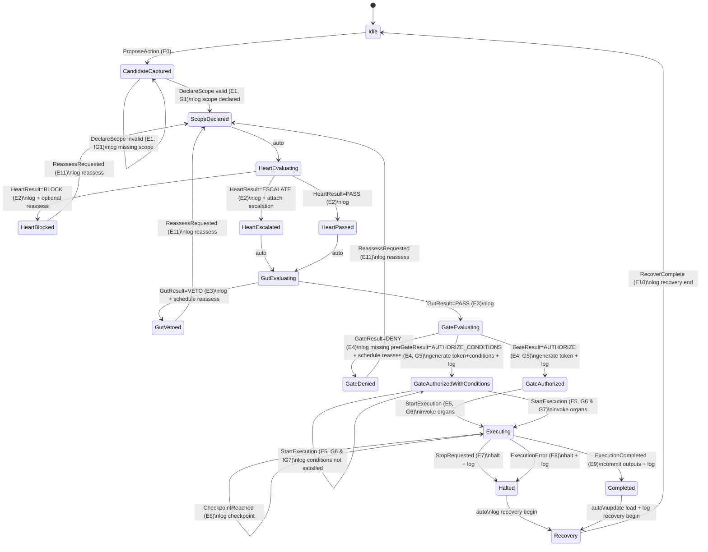

## Test Suite

# Test Categories

**A. Transition Validity Tests**

Verify only legal transitions occur.

**B. Invariant Tests**

Verify I1–I7 always hold.

**C. Authorization Token Tests**

Verify organ calls cannot execute without valid token and scope match.

**D. Logging/Audit Tests**

Verify all terminal states write to Fascia.

**E. Recovery Tests**

Verify halts/completions always enter Recovery and return to Idle.

**F. Property-Based / Fuzz Tests**

Generate random event sequences; ensure no invalid states, no invariant violations.

---

# Transition Validity Unit Tests

**Test: Cannot evaluate Heart without complete scope**

- Given: state = CandidateCaptured
- When: attempt auto-transition to HeartEvaluating
- Expect: blocked (must remain CandidateCaptured)
- Assert: log indicates missing scope prereqs

**Test: Scope invalid loops in CandidateCaptured**

- Given: CandidateCaptured
- When: E1 DeclareScope with missing required fields
- Expect: state remains CandidateCaptured
- Assert: A1 log includes which fields missing

**Test: Heart results route correctly**

- Given: HeartEvaluating
- When: E2 returns BLOCK
- Expect: HeartBlocked
- Repeat for ESCALATE → HeartEscalated, PASS → HeartPassed

**Test: Gut results route correctly**

- Given: GutEvaluating
- When: VETO → GutVetoed
- When: PASS → GateEvaluating

**Test: Gate results route correctly**

- GateEvaluating + DENY → GateDenied
- GateEvaluating + AUTHORIZE (with prereqs) → GateAuthorized
- GateEvaluating + AUTHORIZE_CONDITIONS → GateAuthorizedWithConditions

**Test: Conditions prevent execution**

- Given: GateAuthorizedWithConditions, token valid, conditions false
- When: E5 StartExecution
- Expect: remain GateAuthorizedWithConditions
- Assert: log “conditions not satisfied”

---

# Invariant Tests (I1–I7)

**I1 — No execution without gate token**

- Attempt: transition to Executing without E5 StartExecution(token)
- Expect: impossible
- Attempt: invoke Organ directly without token
- Expect: hard failure / security violation flag

**I2 — Heart never authorizes execution**

- Ensure: no transition exists from any Heart state directly to GateAuthorized/Executing
- Fuzz: random E2 sequences should never produce token issuance

**I3 — Gut never authorizes execution**

- Ensure: Gut PASS transitions only to GateEvaluating, never to Executing

**I4 — All terminal stops write to Fascia**

- For each terminal/stop outcome:
    - HeartBlocked, GutVetoed, GateDenied, Completed, Halted
- Assert: A1 WriteFasciaLog is called with appropriate event type + payload

**I5 — Stop is always available**

- Given: state = Executing
- When: E7 StopRequested at any time
- Expect: transition to Halted
- Assert: token revoked / execution halted; partial outputs preserved

**I6 — Scope must precede Heart**

- Ensure: HeartEvaluating can only be entered from ScopeDeclared
- Negative test: any other entry path fails

**I7 — Conditions enforceable**

- If state = GateAuthorizedWithConditions:
    - StartExecution only allowed if G7 true
    - Verify explicit condition evaluation exists (not “best effort”)
    

---

# Authorization Token Tests

**Token structure validation**

- Assert token includes:
    - allowed_organs
    - scope_hash
    - ttl/expiry
    - domain
    - dimension cap (optional but recommended)

**Token expiry test**

- Given: token expired
- When: E5 StartExecution
- Expect: denied (stay authorized state or route to GateDenied depending design)
- Assert: log indicates expiry

**Scope hash match**

- Given: token scope_hash != current scope plan hash
- When: Organ tries to execute
- Expect: blocked, security violation logged

**Organ whitelist**

- Given: token does not include OrganX
- When: OrganX invoked with token
- Expect: blocked, logged

**Revocation on stop**

- Given: executing
- When: StopRequested
- Assert: token revoked; further organ calls denied even if they still have token_id

---

# Logging/Audit Tests

**Denial logging completeness**

- GateDenied must log:
    - missing prereqs list
    - suggested reroute (optional)
    - reassess trigger info

**Veto logging completeness**

- GutVetoed must log:
    - veto reason category (load/risk/fragility)
    - suggested reassess condition (sleep/reduce scope/etc.)

**Completion logging completeness**

- Completed must log:
    - outputs_ref
    - organ invocations used
    - exceptions if any

---

# Recovery Tests

**Halt → Recovery → Idle**

- Given: Halted
- Expect: auto enters Recovery
- After E10 RecoverComplete → Idle
- Assert: load update performed if configured

**Completed → Recovery → Idle**

- Similar path with output commit + load update

**Recovery never skipped**

- Ensure no transition exists from Halted/Completed directly to Idle

---

# Property-Based / Fuzz Tests (High Value)

**Random event sequence safety**

- Generate sequences of events E0–E11 with random guards
- Run for N steps
- Assert:
    - never enters Executing without token
    - never enters HeartEvaluating without scope
    - stop always transitions out of Executing
    - all terminal states produce a fascia log entry

**Chaos test: interruptions**

- In Executing, inject StopRequested / ExecutionError at random times
- Assert consistent Halted → Recovery path
- Assert partial outputs persisted if any

**Escalation stress**

- Frequent HeartEscalate + GutPass + GateAuthorizeWithConditions
- Assert conditions consistently prevent unsafe execution

## YAML spec

```yaml
# ASM-1: Authorization State Machine Spec (machine-readable)
# Scope: Heart + Gut + Execution Gate + Execution + Recovery
# Note: Guards (G*) and Actions (A*) are referenced by name; implementers bind them to code.

id: ASM-1
name: Authorization State Machine
version: 1.0.0

states:
  - id: S0
    name: Idle
    type: initial
  - id: S1
    name: CandidateCaptured
  - id: S2
    name: ScopeDeclared
  - id: S3
    name: HeartEvaluating
  - id: S4
    name: HeartBlocked
    type: terminal
  - id: S5
    name: HeartEscalated
  - id: S6
    name: HeartPassed
  - id: S7
    name: GutEvaluating
  - id: S8
    name: GutVetoed
    type: terminal
  - id: S9
    name: GateEvaluating
  - id: S10
    name: GateDenied
    type: terminal
  - id: S11
    name: GateAuthorized
  - id: S12
    name: GateAuthorizedWithConditions
  - id: S13
    name: Executing
  - id: S14
    name: Completed
    type: terminal
  - id: S15
    name: Halted
    type: terminal
  - id: S16
    name: Recovery

events:
  - id: E0
    name: ProposeAction
    payload:
      - action_ref
  - id: E1
    name: DeclareScope
    payload:
      - scope_blob
  - id: E2
    name: HeartResult
    payload:
      - result  # BLOCK | ESCALATE | PASS
  - id: E3
    name: GutResult
    payload:
      - result  # VETO | PASS
  - id: E4
    name: GateResult
    payload:
      - result  # DENY | AUTHORIZE | AUTHORIZE_CONDITIONS
  - id: E5
    name: StartExecution
    payload:
      - token
  - id: E6
    name: CheckpointReached
    payload:
      - checkpoint_id
  - id: E7
    name: StopRequested
    payload:
      - source
  - id: E8
    name: ExecutionError
    payload:
      - error_ref
  - id: E9
    name: ExecutionCompleted
    payload:
      - outputs_ref
  - id: E10
    name: RecoverComplete
  - id: E11
    name: ReassessRequested

guards:
  - id: G1
    name: ScopeComplete
    description: >
      scope_blob includes required fields:
      organs/tools, inputs/outputs, reversibility_class, blast_radius,
      stop_condition, monitoring/checkpoints.
  - id: G3
    name: ElevatedScrutinyFlag
    description: Heart escalated OR irreversibility/high blast radius.
  - id: G5
    name: GatePrereqsMet
    description: >
      Domain + dimension appropriate; logging enabled; stop condition exists;
      organs available; (optionally) escalation handled.
  - id: G6
    name: TokenValid
    description: Token is issued by gate, unexpired, within scope, not revoked.
  - id: G7
    name: ConditionsSatisfied
    description: All gate-imposed conditions are currently satisfied.
  - id: G8
    name: StopAllowed
    description: Always true. Stop is always available.

actions:
  - id: A1
    name: WriteFasciaLog
    params: [type, payload]
  - id: A2
    name: AttachEscalation
    params: [scope_blob]
  - id: A3
    name: ScheduleReassess
    params: [trigger]
  - id: A4
    name: GenerateToken
    params: [scope, conditions, ttl]
  - id: A5
    name: InvokeOrgans
    params: [token, organ_plan]
  - id: A6
    name: CommitOutputs
    params: [outputs_ref]
  - id: A7
    name: UpdateLoadSignals
    params: [load_delta]
  - id: A9
    name: HaltExecution
    params: [reason]

transitions:
  # --- Propose + Scope ---
  - from: S0
    event: E0
    to: S1
    actions:
      - { action: A1, args: { type: "candidate_proposed", payload: { action_ref: "${action_ref}" } } }

  - from: S1
    event: E1
    guard: G1
    to: S2
    actions:
      - { action: A1, args: { type: "scope_declared", payload: { scope: "${scope_blob}" } } }

  - from: S1
    event: E1
    guard_not: G1
    to: S1
    actions:
      - { action: A1, args: { type: "scope_incomplete", payload: { scope: "${scope_blob}" } } }

  # --- Heart ---
  - from: S2
    event: auto
    to: S3

  - from: S3
    event: E2
    when: { result: "BLOCK" }
    to: S4
    actions:
      - { action: A1, args: { type: "heart_block", payload: { reason: "boundary_or_integrity_violation" } } }
      - { action: A3, args: { trigger: "optional_reassess" } }

  - from: S3
    event: E2
    when: { result: "ESCALATE" }
    to: S5
    actions:
      - { action: A1, args: { type: "heart_escalate", payload: { note: "elevated_scrutiny_required" } } }
      - { action: A2, args: { scope_blob: "${scope_blob}" } }

  - from: S3
    event: E2
    when: { result: "PASS" }
    to: S6
    actions:
      - { action: A1, args: { type: "heart_pass", payload: {} } }

  # --- Gut ---
  - from: S5
    event: auto
    to: S7
  - from: S6
    event: auto
    to: S7

  - from: S7
    event: E3
    when: { result: "VETO" }
    to: S8
    actions:
      - { action: A1, args: { type: "gut_veto", payload: { reason: "not_now_load_risk_fragility" } } }
      - { action: A3, args: { trigger: "reassess_when_ready" } }

  - from: S7
    event: E3
    when: { result: "PASS" }
    to: S9
    actions:
      - { action: A1, args: { type: "gut_pass", payload: {} } }

  # --- Gate ---
  - from: S9
    event: E4
    when: { result: "DENY" }
    to: S10
    actions:
      - { action: A1, args: { type: "gate_deny", payload: { reason: "missing_prereqs_or_risk_too_high" } } }
      - { action: A3, args: { trigger: "reassess_after_prereqs" } }

  - from: S9
    event: E4
    when: { result: "AUTHORIZE" }
    guard: G5
    to: S11
    actions:
      - { action: A4, args: { scope: "${scope_blob}", conditions: null, ttl: "default" } }
      - { action: A1, args: { type: "gate_authorize", payload: { token_issued: true } } }

  - from: S9
    event: E4
    when: { result: "AUTHORIZE_CONDITIONS" }
    guard: G5
    to: S12
    actions:
      - { action: A4, args: { scope: "${scope_blob}", conditions: "attached", ttl: "default" } }
      - { action: A1, args: { type: "gate_authorize_conditions", payload: { token_issued: true } } }

  # --- Start execution ---
  - from: S11
    event: E5
    guard: G6
    to: S13
    actions:
      - { action: A5, args: { token: "${token}", organ_plan: "from_scope" } }

  - from: S12
    event: E5
    guard: G6
    guard_not: G7
    to: S12
    actions:
      - { action: A1, args: { type: "conditions_not_satisfied", payload: {} } }

  - from: S12
    event: E5
    guard: G6
    guard2: G7
    to: S13
    actions:
      - { action: A5, args: { token: "${token}", organ_plan: "from_scope" } }

  # --- Executing ---
  - from: S13
    event: E6
    to: S13
    actions:
      - { action: A1, args: { type: "checkpoint", payload: { checkpoint_id: "${checkpoint_id}" } } }

  - from: S13
    event: E7
    guard: G8
    to: S15
    actions:
      - { action: A9, args: { reason: "stop_requested" } }
      - { action: A1, args: { type: "halted", payload: { source: "${source}" } } }

  - from: S13
    event: E8
    to: S15
    actions:
      - { action: A9, args: { reason: "execution_error" } }
      - { action: A1, args: { type: "halted_error", payload: { error_ref: "${error_ref}" } } }

  - from: S13
    event: E9
    to: S14
    actions:
      - { action: A6, args: { outputs_ref: "${outputs_ref}" } }
      - { action: A1, args: { type: "completed", payload: { outputs_ref: "${outputs_ref}" } } }

  # --- Recovery ---
  - from: S15
    event: auto
    to: S16
    actions:
      - { action: A1, args: { type: "recovery_begin", payload: { from: "halted" } } }

  - from: S14
    event: auto
    to: S16
    actions:
      - { action: A7, args: { load_delta: "compute" } }
      - { action: A1, args: { type: "recovery_begin", payload: { from: "completed" } } }

  - from: S16
    event: E10
    to: S0
    actions:
      - { action: A1, args: { type: "recovery_end", payload: {} } }

  # --- Reassess paths ---
  - from: S8
    event: E11
    to: S2
    actions:
      - { action: A1, args: { type: "reassess", payload: { from: "gut_vetoed" } } }

  - from: S10
    event: E11
    to: S2
    actions:
      - { action: A1, args: { type: "reassess", payload: { from: "gate_denied" } } }

  - from: S4
    event: E11
    to: S2
    actions:
      - { action: A1, args: { type: "reassess", payload: { from: "heart_blocked" } } }

invariants:
  - id: I1
    name: NoExecutionWithoutToken
    statement: Organs MUST validate G6 TokenValid; execution without token is a violation.
  - id: I2
    name: HeartNeverAuthorizes
    statement: No transition from Heart states directly to S13 Executing.
  - id: I3
    name: GutNeverAuthorizes
    statement: Gut PASS transitions only to GateEvaluating; never to S13.
  - id: I4
    name: TerminalWritesFascia
    statement: All terminal states must A1 WriteFasciaLog.
  - id: I5
    name: StopAlwaysAvailable
    statement: From S13, E7 StopRequested must always transition to S15.
  - id: I6
    name: ScopeBeforeHeart
    statement: No entry to S3 unless G1 satisfied.
  - id: I7
    name: ConditionsEnforced
    statement: In S12, StartExecution allowed only if G7 satisfied.

token_model:
  required_fields:
    - token_id
    - action_ref
    - domain
    - allowed_organs
    - scope_hash
    - ttl
    - revoked
  optional_fields:
    - dimension_cap
    - conditions
  organ_validation_rules:
    - token exists and not revoked
    - not expired
    - organ in allowed_organs
    - scope_hash matches current plan
    - conditions satisfied (if present)
```

## Sequence Diagram

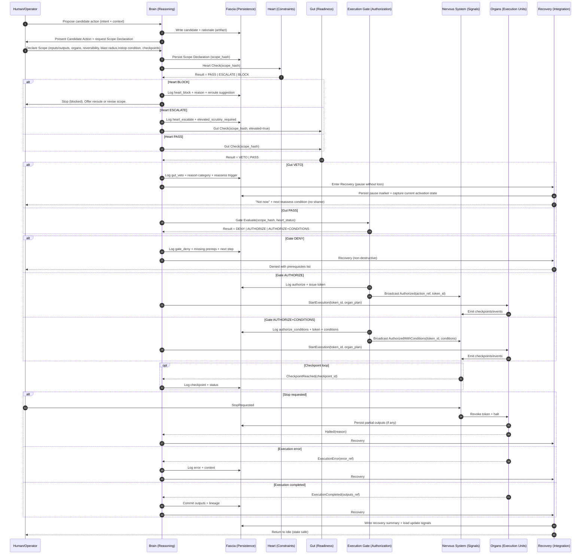

## Property Test Oracle Spec

---

# 1) Canonical Event Trace Schema (Log Contract)

Each log entry must minimally include:

```json
{
  "ts": "ISO-8601",
  "event": "E0|E1|E2|E3|E4|E5|E6|E7|E8|E9|E10|E11|AUTO",
  "state_before": "S0..S16",
  "state_after": "S0..S16",
  "action_ref": "string|null",
  "scope_hash": "string|null",
  "token_id": "string|null",
  "details": { "any": "..." }
}

```

Optional but very useful:

- `organs_invoked: ["OrganA", "OrganB"]`
- `token_allowed_organs: [...]`
- `token_expiry_ts`
- `conditions: [...]` and `conditions_satisfied: true/false`
- `denial_reason`, `veto_reason`
- `domain`, `dimension_cap`

> The oracle assumes “truth” is what the logs claim. If logs are incomplete, the oracle flags “INSUFFICIENT_EVIDENCE” rather than guessing.
> 

---

# 2) Oracle Properties (Invariant Checks)

These are the **architecture invariants** expressed as testable properties.

## P1 — No execution without gate token (I1)

**Forbidden:** any transition into `S13 Executing` without a valid `token_id`.

Stronger form:

- Every organ invocation must reference a valid token.
- Token must be issued by the gate earlier in the trace.

## P2 — Heart never authorizes execution (I2)

**Forbidden:** any transition path where `E2 HeartResult` directly leads to `S11/S12/S13` without passing through `S7/S9` properly.

Simpler rule:

- No transition from `S3/S5/S6` directly to `S11/S12/S13`.

## P3 — Gut never authorizes execution (I3)

- No transition from `S7 GutEvaluating` directly to `S11/S12/S13`.
- Gut PASS must go to `S9 GateEvaluating`.

## P4 — Terminal outcomes are logged (I4)

For terminal states `S4, S8, S10, S14, S15`, the trace must include an explicit log record for the terminal event and a Fascia write marker (or a guaranteed `A1` marker).

If your event format doesn’t include A1 explicitly, use:

- `details.audit_written == true` (or equivalent).

## P5 — Stop always available (I5)

If we are in `S13 Executing` and an `E7 StopRequested` occurs, the next state must become `S15 Halted` (immediately or within 1 step if you model async).

## P6 — Scope precedes Heart evaluation (I6)

No `S3 HeartEvaluating` unless a prior `E1 DeclareScope` created `S2 ScopeDeclared` with `scope_hash`.

## P7 — Conditions enforced (I7)

If state `S12 GateAuthorizedWithConditions`, then any `E5 StartExecution` must show `conditions_satisfied == true` (or trace evidence that G7 was satisfied).

## P8 — Token lifecycle sanity (supporting)

- Token must be issued before use.
- Token must not be expired at time of use (if expiry is logged).
- Token must not be revoked at time of use.

## P9 — Recovery not skipped (supporting)

After `S14 Completed` or `S15 Halted`, the trace must pass through `S16 Recovery` before returning to `S0 Idle`.

(If you intentionally allow skipping Recovery, delete this property.)

---

# 3) Reference Oracle Implementation (Python-like)

This is designed so you can drop it into real code later with minimal changes.

```python
from dataclasses import dataclass
from typing import Any, Dict, List, Optional, Set, Tuple

@dataclass
class TraceEvent:
    ts: str
    event: str
    state_before: str
    state_after: str
    action_ref: Optional[str] = None
    scope_hash: Optional[str] = None
    token_id: Optional[str] = None
    details: Dict[str, Any] = None

TERMINAL_STATES = {"S4", "S8", "S10", "S14", "S15"}

class Violation:
    def __init__(self, code: str, idx: int, msg: str, evidence: Dict[str, Any] = None):
        self.code = code
        self.idx = idx
        self.msg = msg
        self.evidence = evidence or {}

def oracle_validate(trace: List[TraceEvent]) -> List[Violation]:
    violations: List[Violation] = []

    # Track what we have seen
    seen_scope_hashes: Set[str] = set()
    issued_tokens: Dict[str, Dict[str, Any]] = {}  # token_id -> metadata
    revoked_tokens: Set[str] = set()

    def get(ev: TraceEvent, key: str, default=None):
        if ev.details is None:
            return default
        return ev.details.get(key, default)

    # Helper: record token issuance
    def record_token_issued(ev: TraceEvent):
        token_id = ev.token_id or get(ev, "token_id")
        if not token_id:
            return
        issued_tokens[token_id] = {
            "issued_at": ev.ts,
            "scope_hash": ev.scope_hash or get(ev, "scope_hash"),
            "allowed_organs": get(ev, "allowed_organs"),
            "expiry_ts": get(ev, "expiry_ts"),
            "conditions": get(ev, "conditions")
        }

    # Helper: validate token is known and not revoked/expired (if known)
    def token_is_valid(ev: TraceEvent, token_id: str) -> Tuple[bool, str]:
        if token_id not in issued_tokens:
            return False, "TOKEN_NOT_ISSUED"
        if token_id in revoked_tokens:
            return False, "TOKEN_REVOKED"
        # Optional expiry check if you log expiry
        expiry_ts = issued_tokens[token_id].get("expiry_ts")
        if expiry_ts and ev.ts >= expiry_ts:  # simplistic; real code parses timestamps
            return False, "TOKEN_EXPIRED"
        return True, "OK"

    for i, ev in enumerate(trace):
        # P6: scope precedes Heart evaluation
        if ev.state_after == "S2" and ev.event == "E1":
            if ev.scope_hash:
                seen_scope_hashes.add(ev.scope_hash)

        if ev.state_after == "S3":  # HeartEvaluating
            if not ev.scope_hash or ev.scope_hash not in seen_scope_hashes:
                violations.append(Violation(
                    "I6_SCOPE_BEFORE_HEART",
                    i,
                    "Entered HeartEvaluating without prior valid ScopeDeclared.",
                    {"scope_hash": ev.scope_hash, "state_before": ev.state_before}
                ))

        # Token issuance: (gate authorize events)
        if ev.event == "E4" and ev.state_after in {"S11", "S12"}:
            record_token_issued(ev)

        # Token revocation signal (optional pattern)
        if ev.event == "E7" and ev.state_before == "S13":
            # Stop requested during execution implies token should be revoked soon
            if ev.token_id:
                revoked_tokens.add(ev.token_id)

        # P1: no execution without token
        if ev.state_after == "S13":  # Executing
            token_id = ev.token_id or get(ev, "token_id")
            if not token_id:
                violations.append(Violation(
                    "I1_NO_EXEC_WITHOUT_TOKEN",
                    i,
                    "Entered Executing without token_id.",
                    {"state_before": ev.state_before}
                ))
            else:
                ok, reason = token_is_valid(ev, token_id)
                if not ok:
                    violations.append(Violation(
                        "I1_TOKEN_INVALID",
                        i,
                        f"Entered Executing with invalid token: {reason}",
                        {"token_id": token_id, "reason": reason}
                    ))

        # P2: Heart never authorizes execution (no direct transitions)
        if ev.state_before in {"S3", "S5", "S6"} and ev.state_after in {"S11", "S12", "S13"}:
            violations.append(Violation(
                "I2_HEART_DIRECT_AUTH",
                i,
                "Illegal transition: Heart state directly to authorization/execution.",
                {"state_before": ev.state_before, "state_after": ev.state_after}
            ))

        # P3: Gut never authorizes execution
        if ev.state_before == "S7" and ev.state_after in {"S11", "S12", "S13"}:
            violations.append(Violation(
                "I3_GUT_DIRECT_AUTH",
                i,
                "Illegal transition: GutEvaluating directly to authorization/execution.",
                {"state_after": ev.state_after}
            ))

        # P7: Conditions enforced
        if ev.state_before == "S12" and ev.event == "E5" and ev.state_after == "S13":
            satisfied = get(ev, "conditions_satisfied")
            if satisfied is not True:
                violations.append(Violation(
                    "I7_CONDITIONS_NOT_ENFORCED",
                    i,
                    "Started execution from AuthorizedWithConditions without evidence conditions were satisfied.",
                    {"conditions_satisfied": satisfied}
                ))

        # P5: Stop always available (execution -> halted upon stop)
        if ev.event == "E7" and ev.state_before == "S13":
            if ev.state_after != "S15":
                violations.append(Violation(
                    "I5_STOP_NOT_HONORED",
                    i,
                    "StopRequested during execution did not transition to Halted.",
                    {"state_after": ev.state_after}
                ))

        # P4: terminal writes to Fascia
        if ev.state_after in TERMINAL_STATES:
            audit_written = get(ev, "audit_written")
            if audit_written is not True:
                violations.append(Violation(
                    "I4_TERMINAL_NOT_LOGGED",
                    i,
                    "Terminal state reached without evidence of audit/Fascia write.",
                    {"terminal": ev.state_after}
                ))

    # P9: Recovery not skipped (post-check scan)
    for i in range(len(trace) - 1):
        a, b = trace[i], trace[i + 1]
        if a.state_after in {"S14", "S15"}:
            # Require that some subsequent event enters Recovery before returning to Idle
            saw_recovery = any(e.state_after == "S16" for e in trace[i+1:])
            if not saw_recovery:
                violations.append(Violation(
                    "P9_RECOVERY_SKIPPED",
                    i,
                    "Completed/Halted but no Recovery state observed afterward.",
                    {"from_terminal": a.state_after}
                ))

    return violations

```

### How to use it (conceptually)

- Feed it a trace exported from your system (or even manually recorded).
- Any returned violations indicate architecture breaks.
- “INSUFFICIENT_EVIDENCE” can be added if you want “soft failures” when logs omit required fields.

---

# 4) Property-Based Test Harness Outline

If you use Hypothesis (Python), QuickCheck (Haskell), FsCheck (.NET), or fast-check (JS), the structure is:

## A) Generator

Generate random sequences of events with random states (or semi-valid sequences), then validate:

- if you generate **semi-valid** sequences → oracle should return **no violations**
- if you generate **chaos** sequences → oracle should return **some violations** but must never crash

## B) Properties

### Property 1 — Oracle never crashes

- For any random trace, `oracle_validate(trace)` terminates.

### Property 2 — Valid traces have no violations

- Given a known-good trace builder, oracle returns empty.

### Property 3 — Tokenless execution is always detected

- Mutate a valid trace by removing token_id at an execution step.
- Oracle must report `I1_NO_EXEC_WITHOUT_TOKEN`.

### Property 4 — Stop not honored is always detected

- Mutate a trace: StopRequested while executing but keep state_after != Halted.
- Oracle must report `I5_STOP_NOT_HONORED`.

### Property 5 — Scope-before-heart is always detected

- Mutate a trace: jump to S3 without prior scope.
- Oracle must report `I6_SCOPE_BEFORE_HEART`.

### Property 6 — Condition bypass is detected

- Mutate a trace: S12 + StartExecution to S13 with conditions_satisfied != True.
- Oracle must report `I7_CONDITIONS_NOT_ENFORCED`.

---

## 

## Test examples

## 1) Known-Good Trace Examples

### Event shorthand

- `event`: E0..E11, plus `AUTO`
- `audit_written`: set `true` whenever the system “writes to Fascia” (or your logging layer)
- `scope_hash`: treat as an immutable identifier for the declared scope
- `token_id`: treat as the gate-issued authorization token

> These examples are “minimal but sufficient” to pass the oracle you requested.
> 

### A) Golden Path (PASS → PASS → AUTHORIZE → EXECUTE → COMPLETE → RECOVER)

```json
[
  {"ts":"2026-01-11T10:00:00Z","event":"E0","state_before":"S0","state_after":"S1","action_ref":"A1","details":{"audit_written":true}},
  {"ts":"2026-01-11T10:00:10Z","event":"E1","state_before":"S1","state_after":"S2","action_ref":"A1","scope_hash":"SCOPE123","details":{"audit_written":true}},
  {"ts":"2026-01-11T10:00:11Z","event":"AUTO","state_before":"S2","state_after":"S3","action_ref":"A1","scope_hash":"SCOPE123","details":{}},

  {"ts":"2026-01-11T10:00:12Z","event":"E2","state_before":"S3","state_after":"S6","action_ref":"A1","scope_hash":"SCOPE123","details":{"result":"PASS","audit_written":true}},
  {"ts":"2026-01-11T10:00:13Z","event":"AUTO","state_before":"S6","state_after":"S7","action_ref":"A1","scope_hash":"SCOPE123","details":{}},

  {"ts":"2026-01-11T10:00:14Z","event":"E3","state_before":"S7","state_after":"S9","action_ref":"A1","scope_hash":"SCOPE123","details":{"result":"PASS","audit_written":true}},

  {"ts":"2026-01-11T10:00:15Z","event":"E4","state_before":"S9","state_after":"S11","action_ref":"A1","scope_hash":"SCOPE123","token_id":"TKN1",
   "details":{"result":"AUTHORIZE","audit_written":true,"allowed_organs":["O_SEARCH","O_WRITE"],"expiry_ts":"2026-01-11T10:30:00Z"}},

  {"ts":"2026-01-11T10:00:16Z","event":"E5","state_before":"S11","state_after":"S13","action_ref":"A1","scope_hash":"SCOPE123","token_id":"TKN1",
   "details":{"audit_written":true,"token_id":"TKN1","organs_invoked":["O_SEARCH"]}},

  {"ts":"2026-01-11T10:00:20Z","event":"E9","state_before":"S13","state_after":"S14","action_ref":"A1","scope_hash":"SCOPE123","token_id":"TKN1",
   "details":{"audit_written":true,"outputs_ref":"OUT1"}},

  {"ts":"2026-01-11T10:00:21Z","event":"AUTO","state_before":"S14","state_after":"S16","action_ref":"A1","scope_hash":"SCOPE123","details":{"audit_written":true}},
  {"ts":"2026-01-11T10:00:25Z","event":"E10","state_before":"S16","state_after":"S0","action_ref":"A1","scope_hash":"SCOPE123","details":{"audit_written":true}}
]

```

### B) Heart BLOCK (normative stop)

```json
[
  {"ts":"2026-01-11T11:00:00Z","event":"E0","state_before":"S0","state_after":"S1","action_ref":"A2","details":{"audit_written":true}},
  {"ts":"2026-01-11T11:00:10Z","event":"E1","state_before":"S1","state_after":"S2","action_ref":"A2","scope_hash":"SCOPE200","details":{"audit_written":true}},
  {"ts":"2026-01-11T11:00:11Z","event":"AUTO","state_before":"S2","state_after":"S3","action_ref":"A2","scope_hash":"SCOPE200","details":{}},

  {"ts":"2026-01-11T11:00:12Z","event":"E2","state_before":"S3","state_after":"S4","action_ref":"A2","scope_hash":"SCOPE200",
   "details":{"result":"BLOCK","audit_written":true,"reason":"boundary_violation"}}
]

```

(HeartBlocked is terminal in the oracle; if you want Recovery after HeartBlocked too, we can add it and adjust P9 accordingly.)

### C) Gut VETO (allowed but “not now”)

```json
[
  {"ts":"2026-01-11T12:00:00Z","event":"E0","state_before":"S0","state_after":"S1","action_ref":"A3","details":{"audit_written":true}},
  {"ts":"2026-01-11T12:00:10Z","event":"E1","state_before":"S1","state_after":"S2","action_ref":"A3","scope_hash":"SCOPE300","details":{"audit_written":true}},
  {"ts":"2026-01-11T12:00:11Z","event":"AUTO","state_before":"S2","state_after":"S3","action_ref":"A3","scope_hash":"SCOPE300","details":{}},

  {"ts":"2026-01-11T12:00:12Z","event":"E2","state_before":"S3","state_after":"S6","action_ref":"A3","scope_hash":"SCOPE300","details":{"result":"PASS","audit_written":true}},
  {"ts":"2026-01-11T12:00:13Z","event":"AUTO","state_before":"S6","state_after":"S7","action_ref":"A3","scope_hash":"SCOPE300","details":{}},

  {"ts":"2026-01-11T12:00:14Z","event":"E3","state_before":"S7","state_after":"S8","action_ref":"A3","scope_hash":"SCOPE300",
   "details":{"result":"VETO","audit_written":true,"veto_reason":"load_exceeds_margin"}}
]

```

### D) Gate DENY (prereqs missing / risk too high)

```json
[
  {"ts":"2026-01-11T13:00:00Z","event":"E0","state_before":"S0","state_after":"S1","action_ref":"A4","details":{"audit_written":true}},
  {"ts":"2026-01-11T13:00:10Z","event":"E1","state_before":"S1","state_after":"S2","action_ref":"A4","scope_hash":"SCOPE400","details":{"audit_written":true}},
  {"ts":"2026-01-11T13:00:11Z","event":"AUTO","state_before":"S2","state_after":"S3","action_ref":"A4","scope_hash":"SCOPE400","details":{}},

  {"ts":"2026-01-11T13:00:12Z","event":"E2","state_before":"S3","state_after":"S6","action_ref":"A4","scope_hash":"SCOPE400","details":{"result":"PASS","audit_written":true}},
  {"ts":"2026-01-11T13:00:13Z","event":"AUTO","state_before":"S6","state_after":"S7","action_ref":"A4","scope_hash":"SCOPE400","details":{}},

  {"ts":"2026-01-11T13:00:14Z","event":"E3","state_before":"S7","state_after":"S9","action_ref":"A4","scope_hash":"SCOPE400","details":{"result":"PASS","audit_written":true}},

  {"ts":"2026-01-11T13:00:15Z","event":"E4","state_before":"S9","state_after":"S10","action_ref":"A4","scope_hash":"SCOPE400",
   "details":{"result":"DENY","audit_written":true,"missing_prereqs":["stop_condition","logging_enabled"]}}
]

```

### E) Stop Requested During Execution (must halt + recover)

```json
[
  {"ts":"2026-01-11T14:00:00Z","event":"E0","state_before":"S0","state_after":"S1","action_ref":"A5","details":{"audit_written":true}},
  {"ts":"2026-01-11T14:00:10Z","event":"E1","state_before":"S1","state_after":"S2","action_ref":"A5","scope_hash":"SCOPE500","details":{"audit_written":true}},
  {"ts":"2026-01-11T14:00:11Z","event":"AUTO","state_before":"S2","state_after":"S3","action_ref":"A5","scope_hash":"SCOPE500","details":{}},

  {"ts":"2026-01-11T14:00:12Z","event":"E2","state_before":"S3","state_after":"S6","action_ref":"A5","scope_hash":"SCOPE500","details":{"result":"PASS","audit_written":true}},
  {"ts":"2026-01-11T14:00:13Z","event":"AUTO","state_before":"S6","state_after":"S7","action_ref":"A5","scope_hash":"SCOPE500","details":{}},

  {"ts":"2026-01-11T14:00:14Z","event":"E3","state_before":"S7","state_after":"S9","action_ref":"A5","scope_hash":"SCOPE500","details":{"result":"PASS","audit_written":true}},
  {"ts":"2026-01-11T14:00:15Z","event":"E4","state_before":"S9","state_after":"S11","action_ref":"A5","scope_hash":"SCOPE500","token_id":"TKN5",
   "details":{"result":"AUTHORIZE","audit_written":true,"allowed_organs":["O_WRITE"],"expiry_ts":"2026-01-11T14:30:00Z"}},

  {"ts":"2026-01-11T14:00:16Z","event":"E5","state_before":"S11","state_after":"S13","action_ref":"A5","scope_hash":"SCOPE500","token_id":"TKN5",
   "details":{"audit_written":true,"organs_invoked":["O_WRITE"]}},

  {"ts":"2026-01-11T14:00:18Z","event":"E7","state_before":"S13","state_after":"S15","action_ref":"A5","scope_hash":"SCOPE500","token_id":"TKN5",
   "details":{"audit_written":true,"source":"human_stop"}},

  {"ts":"2026-01-11T14:00:19Z","event":"AUTO","state_before":"S15","state_after":"S16","action_ref":"A5","scope_hash":"SCOPE500","details":{"audit_written":true}},
  {"ts":"2026-01-11T14:00:25Z","event":"E10","state_before":"S16","state_after":"S0","action_ref":"A5","scope_hash":"SCOPE500","details":{"audit_written":true}}
]

```

### F) Authorized With Conditions (must prove conditions satisfied)

```json
[
  {"ts":"2026-01-11T15:00:00Z","event":"E0","state_before":"S0","state_after":"S1","action_ref":"A6","details":{"audit_written":true}},
  {"ts":"2026-01-11T15:00:10Z","event":"E1","state_before":"S1","state_after":"S2","action_ref":"A6","scope_hash":"SCOPE600","details":{"audit_written":true}},
  {"ts":"2026-01-11T15:00:11Z","event":"AUTO","state_before":"S2","state_after":"S3","action_ref":"A6","scope_hash":"SCOPE600","details":{}},

  {"ts":"2026-01-11T15:00:12Z","event":"E2","state_before":"S3","state_after":"S5","action_ref":"A6","scope_hash":"SCOPE600",
   "details":{"result":"ESCALATE","audit_written":true}},

  {"ts":"2026-01-11T15:00:13Z","event":"AUTO","state_before":"S5","state_after":"S7","action_ref":"A6","scope_hash":"SCOPE600","details":{}},
  {"ts":"2026-01-11T15:00:14Z","event":"E3","state_before":"S7","state_after":"S9","action_ref":"A6","scope_hash":"SCOPE600","details":{"result":"PASS","audit_written":true}},

  {"ts":"2026-01-11T15:00:15Z","event":"E4","state_before":"S9","state_after":"S12","action_ref":"A6","scope_hash":"SCOPE600","token_id":"TKN6",
   "details":{"result":"AUTHORIZE_CONDITIONS","audit_written":true,"conditions":["Timebox(10m)","CheckpointEvery(1 step)"],"allowed_organs":["O_API"],"expiry_ts":"2026-01-11T15:30:00Z"}},

  {"ts":"2026-01-11T15:00:16Z","event":"E5","state_before":"S12","state_after":"S13","action_ref":"A6","scope_hash":"SCOPE600","token_id":"TKN6",
   "details":{"audit_written":true,"conditions_satisfied":true,"organs_invoked":["O_API"]}},

  {"ts":"2026-01-11T15:00:20Z","event":"E9","state_before":"S13","state_after":"S14","action_ref":"A6","scope_hash":"SCOPE600","token_id":"TKN6",
   "details":{"audit_written":true,"outputs_ref":"OUT6"}},

  {"ts":"2026-01-11T15:00:21Z","event":"AUTO","state_before":"S14","state_after":"S16","action_ref":"A6","scope_hash":"SCOPE600","details":{"audit_written":true}},
  {"ts":"2026-01-11T15:00:25Z","event":"E10","state_before":"S16","state_after":"S0","action_ref":"A6","scope_hash":"SCOPE600","details":{"audit_written":true}}
]

```

---

## 2) Mutation Operators (Generate Broken Traces)

These are “edit functions” you apply to a known-good trace to create regression tests.

### Token / Execution Mutations

1. **M1 Remove token_id at execution start**
    - Find entry where `state_after == "S13"`; delete `token_id`.
    - Expect violation: `I1_NO_EXEC_WITHOUT_TOKEN`.
2. **M2 Use unknown token_id**
    - Replace `token_id` at start execution with `TKN_UNKNOWN`.
    - Expect violation: `I1_TOKEN_INVALID (TOKEN_NOT_ISSUED)`.
3. **M3 Expire token**
    - Set `expiry_ts` earlier than execution ts.
    - Expect violation: `I1_TOKEN_INVALID (TOKEN_EXPIRED)` (if expiry check enabled).
4. **M4 Revoke token then execute**
    - Add a stop event that revokes the token, then attempt another `S13` transition using same token.
    - Expect violation: `TOKEN_REVOKED`.

### Stop / Recovery Mutations

1. **M5 StopRequested doesn’t halt**
    - In stop trace, change `state_after` on `E7` from `S15` to `S13`.
    - Expect violation: `I5_STOP_NOT_HONORED`.
2. **M6 Skip Recovery**
    - Remove the `AUTO -> S16 Recovery` event after `S14` or `S15`.
    - Expect violation: `P9_RECOVERY_SKIPPED`.

### Scope / Heart Mutations

1. **M7 Enter HeartEvaluating without scope**
    - Insert an event `AUTO: S1 -> S3` or change the `S2->S3` step to be missing `scope_hash`.
    - Expect violation: `I6_SCOPE_BEFORE_HEART`.
2. **M8 Heart directly authorizes**
    - Change a Heart result event to go `S3 -> S11` or `S3 -> S13`.
    - Expect violation: `I2_HEART_DIRECT_AUTH`.

### Gut / Conditions Mutations

1. **M9 Gut directly authorizes**
    - Change `E3 PASS` from `S7 -> S9` to `S7 -> S11`.
    - Expect violation: `I3_GUT_DIRECT_AUTH`.
2. **M10 Condition bypass**
- In conditions trace, set `conditions_satisfied:false` while still transitioning `S12 -> S13`.
- Expect violation: `I7_CONDITIONS_NOT_ENFORCED`.

### Logging Mutations

1. **M11 Remove audit marker at terminal**
- For a terminal state event, set `audit_written:false` or remove it.
- Expect violation: `I4_TERMINAL_NOT_LOGGED`.

---

## 3) README (Easy Understanding)

### README.md

```markdown
# Authorization Trace Oracle (ASM-1)

This project validates whether an **authorization flow** (Heart → Gut → Execution Gate) is being followed correctly.

It does this by checking a **trace log** of state transitions and events against **invariants** like:

- No execution without a gate-issued token
- Scope must be declared before Heart evaluation
- Heart can block/escalate but never authorize execution
- Gut can veto but never authorize execution
- Stop is always honored during execution
- Terminal outcomes are always logged

## What is a "trace"?

A trace is a sequence of log entries. Each entry records:

- which event happened (E0..E11)
- what the state was before and after
- the scope hash (if applicable)
- the token id (if execution is authorized)
- a flag indicating the decision was logged (`audit_written`)

Example entry:

```json
{
  "ts": "2026-01-11T10:00:16Z",
  "event": "E5",
  "state_before": "S11",
  "state_after": "S13",
  "scope_hash": "SCOPE123",
  "token_id": "TKN1",
  "details": { "audit_written": true }
}

```

## How to use

1. Capture a trace from your system (or create one manually).
2. Run the trace through the oracle validator.
3. If violations are reported, the trace broke an invariant.

### Expected outcomes

- A correct trace produces **zero violations**.
- A broken trace produces **one or more violations**, each with:
    - a code (e.g., `I1_NO_EXEC_WITHOUT_TOKEN`)
    - the index in the trace where it occurred
    - a human-readable message

## Included examples

- Golden path: PASS → PASS → AUTHORIZE → EXECUTE → COMPLETE → RECOVER
- Heart block: blocked for value/principle violation
- Gut veto: allowed but "not now"
- Gate deny: missing prerequisites or unacceptable risk
- Stop during execution: must halt and recover
- Authorized with conditions: must prove conditions satisfied

## Mutation operators

Mutation operators are small edits you apply to a valid trace to create broken traces, e.g.:

- remove token_id at execution start (should fail)
- bypass conditions (should fail)
- skip recovery (should fail)

These are great for regression testing.

## Invariants checked (summary)

- **I1**: No execution without valid token
- **I2**: Heart never authorizes execution
- **I3**: Gut never authorizes execution
- **I4**: Terminal outcomes always logged
- **I5**: Stop always honored
- **I6**: Scope before Heart evaluation
- **I7**: Conditions enforced

---

## Repo Structure

**This still needs testing**

---

## Suggested folder layout

```
authorization-trace-oracle/
├─ README.md
├─ spec/
│  ├─ asm-1.yaml
│  ├─ state_diagram.mmd
│  └─ sequence_diagram.mmd
├─ traces/
│  ├─ golden.json
│  ├─ heart_block.json
│  ├─ gut_veto.json
│  ├─ gate_deny.json
│  ├─ stop_during_execution.json
│  └─ authorize_with_conditions.json
├─ oracle/
│  ├─ __init__.py
│  ├─ types.py
│  ├─ validate.py
│  └─ invariants.py
├─ mutations/
│  ├─ __init__.py
│  └─ operators.py
└─ tests/
   ├─ test_golden_passes.py
   ├─ test_mutations_fail.py
   └─ test_oracle_never_crashes.py

```

### What goes where

- `spec/` = architecture truth (YAML + Mermaid diagrams)
- `traces/` = known-good example traces (JSON)
- `oracle/` = the validator + invariant checks
- `mutations/` = “break trace” operators
- `tests/` = regression tests proving the oracle works

---

## Files to add (copy/paste friendly)

### `spec/state_diagram.mmd`

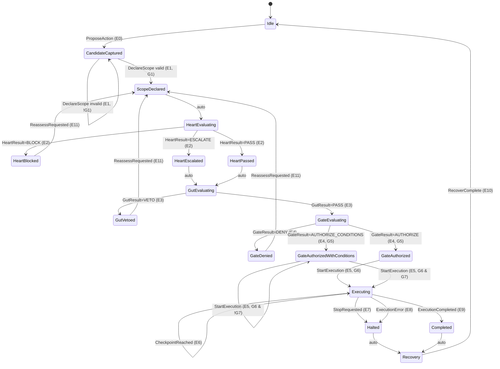

### `spec/sequence_diagram.mmd`

Use the Mermaid sequence diagram I gave earlier (same content). Name it `sequence_diagram.mmd`.

### `spec/asm-1.yaml`

Use the YAML spec I gave earlier as `spec/asm-1.yaml`.

---

## Oracle module skeleton (minimal, clean)

### `oracle/types.py`

```python
from dataclasses import dataclass
from typing import Any, Dict, Optional

@dataclass
class TraceEvent:
    ts: str
    event: str
    state_before: str
    state_after: str
    action_ref: Optional[str] = None
    scope_hash: Optional[str] = None
    token_id: Optional[str] = None
    details: Optional[Dict[str, Any]] = None

@dataclass
class Violation:
    code: str
    idx: int
    msg: str
    evidence: Dict[str, Any]

```

### `oracle/invariants.py`

```python
from typing import Dict, List, Set, Tuple
from .types import TraceEvent, Violation

TERMINAL_STATES: Set[str] = {"S4", "S8", "S10", "S14", "S15"}

def _get(ev: TraceEvent, key: str, default=None):
    if ev.details is None:
        return default
    return ev.details.get(key, default)

def check_invariants(trace: List[TraceEvent]) -> List[Violation]:
    v: List[Violation] = []

    seen_scope_hashes: Set[str] = set()
    issued_tokens: Dict[str, Dict] = {}
    revoked_tokens: Set[str] = set()

    def record_token_issued(ev: TraceEvent):
        tid = ev.token_id or _get(ev, "token_id")
        if not tid:
            return
        issued_tokens[tid] = {
            "issued_at": ev.ts,
            "scope_hash": ev.scope_hash or _get(ev, "scope_hash"),
            "allowed_organs": _get(ev, "allowed_organs"),
            "expiry_ts": _get(ev, "expiry_ts"),
            "conditions": _get(ev, "conditions"),
        }

    def token_valid(ev: TraceEvent, tid: str) -> Tuple[bool, str]:
        if tid not in issued_tokens:
            return False, "TOKEN_NOT_ISSUED"
        if tid in revoked_tokens:
            return False, "TOKEN_REVOKED"
        expiry = issued_tokens[tid].get("expiry_ts")
        if expiry and ev.ts >= expiry:  # simple compare; parse timestamps in real impl
            return False, "TOKEN_EXPIRED"
        return True, "OK"

    for i, ev in enumerate(trace):
        # Track scope declarations
        if ev.event == "E1" and ev.state_after == "S2" and ev.scope_hash:
            seen_scope_hashes.add(ev.scope_hash)

        # I6: Scope before Heart evaluation
        if ev.state_after == "S3":
            if not ev.scope_hash or ev.scope_hash not in seen_scope_hashes:
                v.append(Violation(
                    "I6_SCOPE_BEFORE_HEART", i,
                    "Entered HeartEvaluating without prior valid ScopeDeclared.",
                    {"scope_hash": ev.scope_hash, "state_before": ev.state_before}
                ))

        # Token issuance on Gate authorize
        if ev.event == "E4" and ev.state_after in {"S11", "S12"}:
            record_token_issued(ev)

        # Stop request implies revocation (if token present)
        if ev.event == "E7" and ev.state_before == "S13":
            if ev.token_id:
                revoked_tokens.add(ev.token_id)

        # I1: No execution without token
        if ev.state_after == "S13":
            tid = ev.token_id or _get(ev, "token_id")
            if not tid:
                v.append(Violation(
                    "I1_NO_EXEC_WITHOUT_TOKEN", i,
                    "Entered Executing without token_id.",
                    {"state_before": ev.state_before}
                ))
            else:
                ok, reason = token_valid(ev, tid)
                if not ok:
                    v.append(Violation(
                        "I1_TOKEN_INVALID", i,
                        f"Entered Executing with invalid token: {reason}",
                        {"token_id": tid, "reason": reason}
                    ))

        # I2: Heart never authorizes directly
        if ev.state_before in {"S3", "S5", "S6"} and ev.state_after in {"S11", "S12", "S13"}:
            v.append(Violation(
                "I2_HEART_DIRECT_AUTH", i,
                "Illegal transition: Heart state directly to authorization/execution.",
                {"state_before": ev.state_before, "state_after": ev.state_after}
            ))

        # I3: Gut never authorizes directly
        if ev.state_before == "S7" and ev.state_after in {"S11", "S12", "S13"}:
            v.append(Violation(
                "I3_GUT_DIRECT_AUTH", i,
                "Illegal transition: GutEvaluating directly to authorization/execution.",
                {"state_after": ev.state_after}
            ))

        # I7: Conditions enforced
        if ev.state_before == "S12" and ev.event == "E5" and ev.state_after == "S13":
            if _get(ev, "conditions_satisfied") is not True:
                v.append(Violation(
                    "I7_CONDITIONS_NOT_ENFORCED", i,
                    "Started execution from AuthorizedWithConditions without evidence conditions were satisfied.",
                    {"conditions_satisfied": _get(ev, "conditions_satisfied")}
                ))

        # I5: Stop always honored
        if ev.event == "E7" and ev.state_before == "S13" and ev.state_after != "S15":
            v.append(Violation(
                "I5_STOP_NOT_HONORED", i,
                "StopRequested during execution did not transition to Halted.",
                {"state_after": ev.state_after}
            ))

        # I4: Terminal outcomes logged
        if ev.state_after in TERMINAL_STATES:
            if _get(ev, "audit_written") is not True:
                v.append(Violation(
                    "I4_TERMINAL_NOT_LOGGED", i,
                    "Terminal state reached without evidence of audit/Fascia write.",
                    {"terminal": ev.state_after}
                ))

    # P9: Recovery not skipped after Completed/Halted (optional, but recommended)
    for i in range(len(trace) - 1):
        if trace[i].state_after in {"S14", "S15"}:
            saw_recovery = any(e.state_after == "S16" for e in trace[i+1:])
            if not saw_recovery:
                v.append(Violation(
                    "P9_RECOVERY_SKIPPED", i,
                    "Completed/Halted but no Recovery state observed afterward.",
                    {"from_terminal": trace[i].state_after}
                ))

    return v

```

### `oracle/validate.py`

```python
import json
from typing import List
from .types import TraceEvent, Violation
from .invariants import check_invariants

def parse_trace(raw: list) -> List[TraceEvent]:
    out: List[TraceEvent] = []
    for item in raw:
        out.append(TraceEvent(
            ts=item["ts"],
            event=item["event"],
            state_before=item["state_before"],
            state_after=item["state_after"],
            action_ref=item.get("action_ref"),
            scope_hash=item.get("scope_hash"),
            token_id=item.get("token_id"),
            details=item.get("details") or {},
        ))
    return out

def validate_trace_json(trace_json: str) -> List[Violation]:
    raw = json.loads(trace_json)
    trace = parse_trace(raw)
    return check_invariants(trace)

```

---

## Mutations module

### `mutations/operators.py`

```python
import copy

def m1_remove_token_at_execution(trace):
    t = copy.deepcopy(trace)
    for ev in t:
        if ev.get("state_after") == "S13":
            ev.pop("token_id", None)
            if "details" in ev:
                ev["details"].pop("token_id", None)
            return t
    return t

def m5_stop_not_honored(trace):
    t = copy.deepcopy(trace)
    for ev in t:
        if ev.get("event") == "E7" and ev.get("state_before") == "S13":
            ev["state_after"] = "S13"
            return t
    return t

def m6_skip_recovery(trace):
    t = copy.deepcopy(trace)
    t = [ev for ev in t if not (ev.get("state_after") == "S16" and ev.get("event") == "AUTO")]
    return t

def m10_condition_bypass(trace):
    t = copy.deepcopy(trace)
    for ev in t:
        if ev.get("state_before") == "S12" and ev.get("event") == "E5" and ev.get("state_after") == "S13":
            ev.setdefault("details", {})
            ev["details"]["conditions_satisfied"] = False
            return t
    return t

```

(You can add the rest of the mutation operators later; this is enough to start.)

---

## Tests (outline)

### `tests/test_golden_passes.py`

```python
import json
from oracle.validate import validate_trace_json

def test_golden_trace_has_no_violations():
    with open("traces/golden.json", "r") as f:
        violations = validate_trace_json(f.read())
    assert violations == []

```

### `tests/test_mutations_fail.py`

```python
import json
from oracle.validate import validate_trace_json
from mutations.operators import m1_remove_token_at_execution, m6_skip_recovery

def test_remove_token_fails():
    with open("traces/golden.json","r") as f:
        golden = json.load(f)
    mutated = m1_remove_token_at_execution(golden)
    violations = validate_trace_json(json.dumps(mutated))
    assert any(v.code == "I1_NO_EXEC_WITHOUT_TOKEN" or v.code == "I1_TOKEN_INVALID" for v in violations)

def test_skip_recovery_fails():
    with open("traces/golden.json","r") as f:
        golden = json.load(f)
    mutated = m6_skip_recovery(golden)
    violations = validate_trace_json(json.dumps(mutated))
    assert any(v.code == "P9_RECOVERY_SKIPPED" for v in violations)

```

### `tests/test_oracle_never_crashes.py`

```python
import json
from oracle.validate import validate_trace_json

def test_oracle_handles_empty_trace():
    assert validate_trace_json("[]") == []

def test_oracle_handles_missing_details():
    trace = [{
        "ts":"2026-01-11T00:00:00Z",
        "event":"E0","state_before":"S0","state_after":"S1"
    }]
    validate_trace_json(json.dumps(trace))  # should not throw

```

---

## README.md (expanded, with new sections)

```markdown
# Authorization Trace Oracle (ASM-1)

This repo validates whether your authorization flow follows the architecture:

**Heart → Gut → Execution Gate → Organs → Recovery**

It checks a trace log (event-by-event) against invariants such as:

- No execution without a gate-issued token
- Scope must be declared before Heart evaluation
- Heart can block/escalate but never authorize
- Gut can veto but never authorize
- Stop always halts execution
- Terminal outcomes are always logged
- Recovery isn't skipped (optional but recommended)

---

## Folder structure

- `spec/` — canonical architecture spec (YAML + diagrams)
- `traces/` — known-good example traces (JSON)
- `oracle/` — the validator (invariants + parser)
- `mutations/` — functions that intentionally break traces
- `tests/` — regression tests

---

## Quick start (conceptual)

1. Produce a trace log from your system (or create one manually).
2. Run it through the oracle.
3. If violations appear, something broke an architectural rule.

The oracle never tries to “interpret intent.” It only checks structure.

---

## Trace format

Each event includes:

- `event`: E0..E11 or AUTO
- `state_before`, `state_after`: S0..S16
- `scope_hash`: required for scoped flow
- `token_id`: required for execution
- `details.audit_written`: `true` whenever you wrote the decision to persistence

Example:

```json
{
  "ts": "2026-01-11T10:00:16Z",
  "event": "E5",
  "state_before": "S11",
  "state_after": "S13",
  "scope_hash": "SCOPE123",
  "token_id": "TKN1",
  "details": { "audit_written": true }
}

```

---

## Included traces

- `traces/golden.json` — the standard happy path
- `traces/heart_block.json` — blocked by Heart constraints
- `traces/gut_veto.json` — vetoed by readiness/safety
- `traces/gate_deny.json` — denied by missing prereqs or risk
- `traces/stop_during_execution.json` — stop halts + recovery
- `traces/authorize_with_conditions.json` — conditions must be satisfied

---

## Mutations (how we test failures)

Mutation operators intentionally break a correct trace to ensure the oracle catches violations.

Examples:

- remove token at execution start
- bypass conditions
- skip recovery
- stop request not honored

These are used in regression tests.

---

## How to add a new invariant (important)

### Step 1 — Decide what the invariant protects

Good invariants prevent:

- accidental execution
- authority drift
- silent irreversibility
- coercion-through-constraints
- unlogged terminal states

If it doesn’t protect one of those, it probably doesn’t belong as an invariant.

### Step 2 — Define the violation code and message

Example code: `I8_TOKEN_SCOPE_MISMATCH`

### Step 3 — Implement it in `oracle/invariants.py`

Pattern:

- scan the trace linearly
- keep minimal state (sets/maps)
- append `Violation(code, idx, msg, evidence)` when detected

Keep invariants:

- deterministic
- purely structural
- no moral interpretation

### Step 4 — Add:

- one **known-good** trace that should still pass
- one **mutation** that should fail and trigger the new invariant
- one test in `tests/` that asserts the invariant is detected

### Step 5 — Update the README invariant list

---

## Current invariants checked

- **I1** No execution without valid token
- **I2** Heart never directly authorizes execution
- **I3** Gut never directly authorizes execution
- **I4** Terminal outcomes always logged
- **I5** Stop always honored during execution
- **I6** Scope declared before Heart evaluation
- **I7** Conditions enforced for conditional authorization
- **P9** Recovery not skipped after halt/complete (recommended)

---

## Why this exists

This architecture is meant to keep a cognitive prosthetic trustworthy:

- thinking doesn’t force action
- values don’t coerce execution
- readiness matters as much as permission
- nothing collapses when you pause
- execution can always be stopped
- all decisions remain inspectable over time

The oracle is how you prove your logs match your claims.

```

---

## Want me to add “How to export traces from your app” guidance?
If you tell me what stack you’re using for the workshop app (React + local backend? Node? Python? SQLite?), I can give you a **tiny trace logger spec** that outputs the JSON format above, and a **wrapper** that logs every state transition automatically (so you don’t need to remember to write audit entries).

```

## Recovery Protocol (RP-1)

## Diagram Set — Recovery Protocol (RP-1)

---

## Diagram R1 — Recovery Position in the Global State Machine

**Purpose:**

Show that Recovery is *unavoidable* and *non-bypassable*.

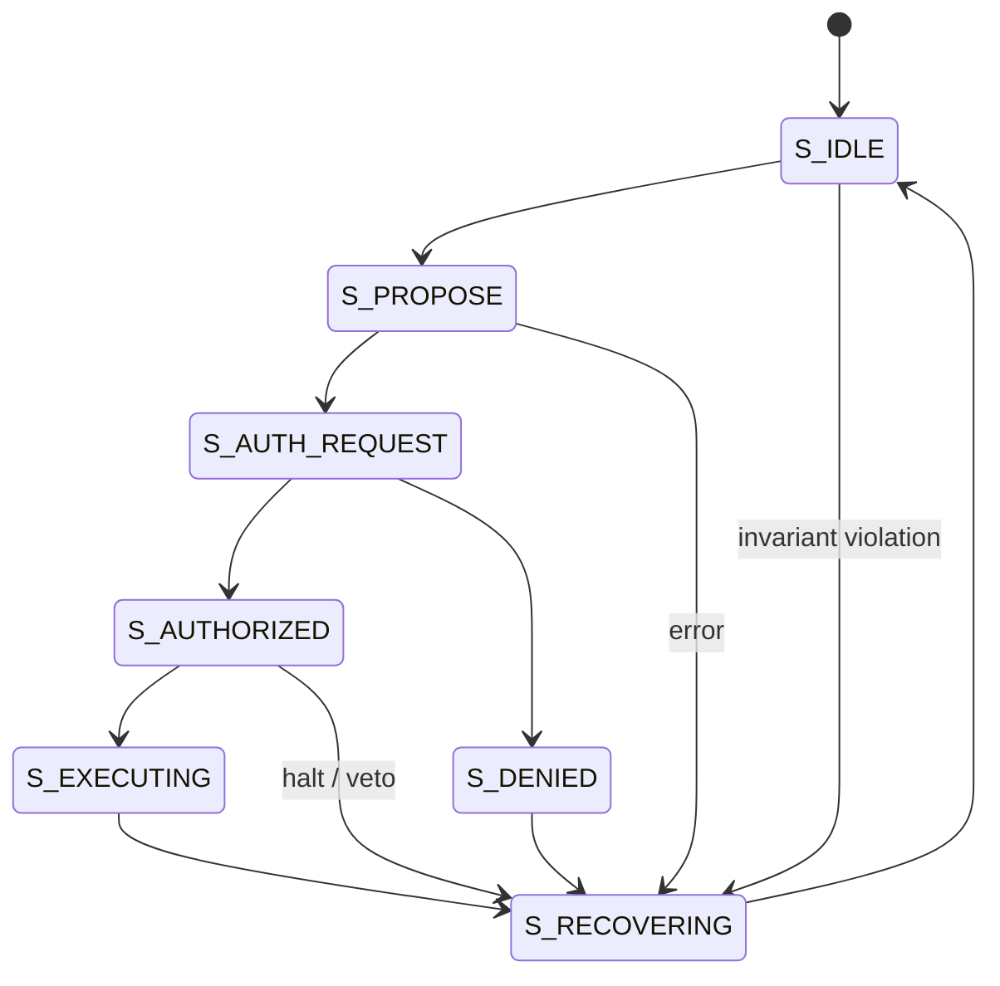

**Caption (paper-ready):**

*Figure R1: Global state machine showing mandatory transition through Recovery after any terminal condition.*

---

## Diagram R2 — Internal Recovery Phases (RP-1)

**Purpose:**

Make Recovery mechanical and inspectable, not conceptual.

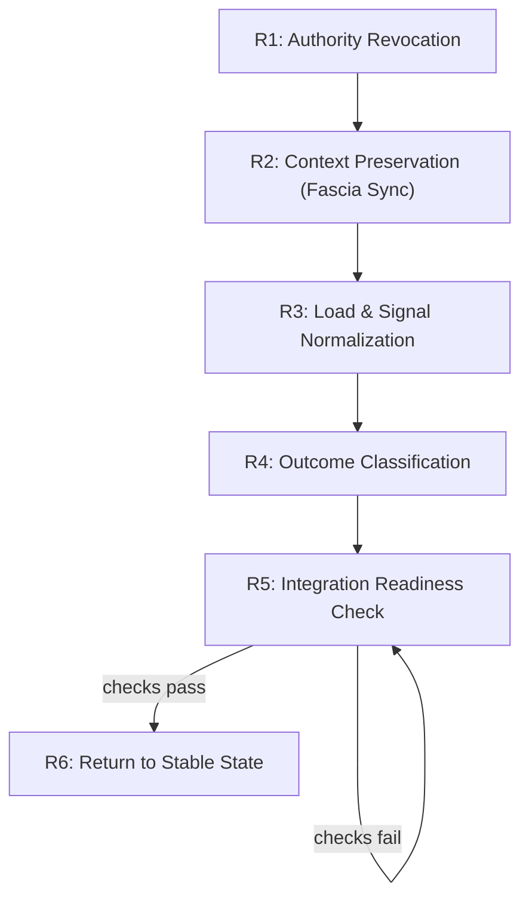

**Key invariant:**

No backward edges except *self-hold* at R5.

---

## Diagram R3 — Authority Lifecycle with Recovery

**Purpose:**

Demonstrate that authority is explicitly revoked and cannot “linger.”

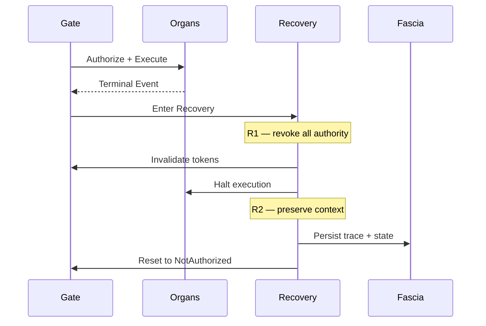

---

## Diagram R4 — Recovery vs Crucible vs Gate (Separation of Roles)

**Purpose:**

Prevent conceptual leakage between governance mechanisms.

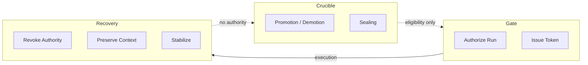

**Invariant:**

Recovery never promotes.

Crucible never executes.

Gate never canonizes.

---

## Diagram R5 — Domain & Dimension Reset During Recovery

**Purpose:**

Show that Recovery *forces* a safe post-execution posture.

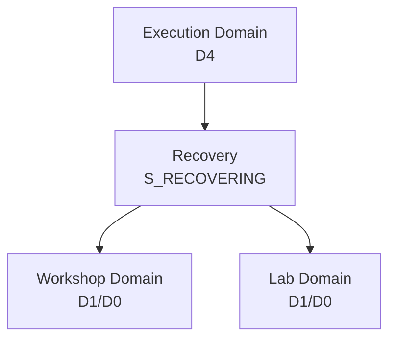

**Rule visualized:**

Execution domain cannot persist past Recovery.

---

## Diagram R6 — Recovery Validation (Oracle Perspective)

**Purpose:**

Show how Recovery is validated from traces.

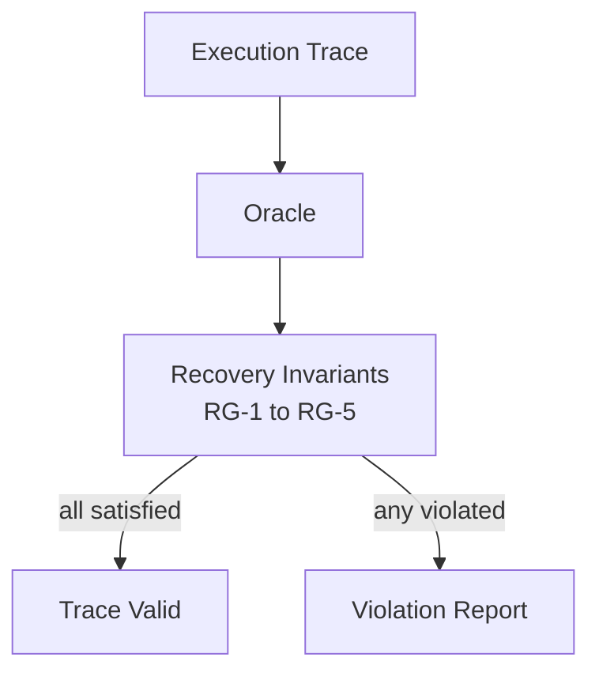

---

# Where These Diagrams Go (Explicit Placement)

### System Specification

- Section **17 — Recovery Protocol**
    - R1 (global state)
    - R2 (phases)
    - R3 (authority lifecycle)

### Canonical Paper

- Section **Recovery and Integration**
    - R1 (mandatory recovery)
    - R2 (phases overview)

### Visual Atlas

- Dedicated **Recovery** subsection
    - All diagrams, minimal text

### Validation Appendix

- R6 (oracle validation)

---

# What’s now complete

With these diagrams added:

- Recovery is **fully specified**
- Recovery is **testable**
- Recovery is **publishable**
- Recovery is **not dependent on narrative explanation**

At this point:

- **Glossary is locked**
- **Crucible + Gate are unified**
- **Recovery is formalized**
- **Meta systems are stable**

---

## Next clean options (pick one)

1. **Worked example trace** (Lab → Workshop → Crucible → Execution → Recovery)
2. **Figure integration into LaTeX** (numbering, captions, references)
3. **Freeze System Spec v1** and do a polish pass
4. **Methods section expansion** (oracle + invariants)

Say the word and we’ll continue with precision.

## Mandatory stabilization after any terminal condition

---

## 1. Purpose of Recovery

**Recovery** is a required system phase that occurs after **any terminal condition**, including:

- successful execution
- denied authorization
- veto (Heart or Gut)
- halt or interruption
- error or invariant violation

Recovery exists to ensure that:

- authority is fully revoked
- context is preserved
- load does not accumulate silently
- the system returns to a safe, inspectable state

**Core axiom**

> No system transition is complete until Recovery has run.
> 

Recovery is not optional, delayed, or manual.

---

## 2. What Recovery Is (and Is Not)

### Recovery **is**

- a protocol
- a state transition
- a stabilization phase
- a context integration mechanism

### Recovery **is not**

- rest (though it may enable rest)
- reflection (though reflection may follow)
- punishment
- retry logic

Recovery does not decide what to do next.

It ensures the system is *able* to decide again.

---

## 3. Entry Conditions

Recovery is entered automatically when the system reaches any terminal state:

| Trigger | Source |
| --- | --- |
| Execution completed | Organs |
| Authorization denied | Execution Gate |
| Veto issued | Heart or Gut |
| Halt requested | Nervous System |
| Error raised | Any layer |
| Invariant violated | Oracle / Immune |

There is no bypass.

---

## 4. Recovery Phases

Recovery proceeds in **strict order**. No phase may be skipped.

### Phase R1 — Authority Revocation

**Objective:**

Ensure no residual authority remains.

Actions:

- Revoke execution tokens
- Invalidate runtime permissions
- Freeze organ invocation
- Lock Gate into `NotAuthorized`

**Invariant:**

> After R1, no component can cause irreversible effect.
> 

### Phase R2 — Context Preservation (Fascia Sync)

**Objective:**

Prevent loss of meaning or state.

Actions:

- Persist:
    - artifact versions
    - execution traces
    - partial outputs
    - decision rationales
- Record terminal condition
- Snapshot active Domain and Dimension

This is **lossless**.

### Phase R3 — Load & Signal Normalization

**Objective:**

Prevent silent accumulation of cost.

Actions:

- Endocrine System updates:
    - load
    - recovery debt
    - fatigue indicators
- Nervous System clears:
    - high-priority interrupts
    - pending execution intents

No interpretation occurs here — only measurement.

### Phase R4 — Outcome Classification

**Objective:**

Label what happened without judgment.

Outcomes are classified as one of:

- `COMPLETED`
- `DENIED`
- `VETOED`
- `HALTED`
- `FAILED`
- `ABORTED`

This classification is recorded but does not trigger behavior.

### Phase R5 — Integration Readiness Check

**Objective:**

Ensure the system is safe to resume cognition.

Checks:

- Are all tokens revoked?
- Is context fully persisted?
- Are load signals within safe bounds?
- Is the Domain restored correctly?

If any check fails → Recovery remains active.

### Phase R6 — Return to Stable State

**Objective:**

Restore a non-executing baseline.

Actions:

- Set Domain to:
    - `Workshop` or `Lab` (never `Execution`)
- Set Dimension to:
    - `D0` or `D1`
- Enable reasoning layers
- Disable execution eligibility checks

Recovery then exits.

---

## 5. Recovery Guarantees (Invariants)

Recovery enforces the following guarantees:

### RG-1 — No Residual Authority

After Recovery, no execution token exists.

### RG-2 — No Context Loss

All relevant state is preserved in Fascia.

### RG-3 — No Forced Next Action

Recovery does not schedule work.

### RG-4 — No Silent Cost

All load effects are recorded.

### RG-5 — No Domain Leakage

Execution Domain cannot persist past Recovery.

---

## 6. Recovery Failure Modes

| Failure | Prevention |
| --- | --- |
| Immediate re-execution | R1 + Domain reset |
| Memory collapse | R2 mandatory sync |
| Burnout | R3 load normalization |
| Shame loop | Outcome classification without judgment |
| Stuck state | R5 readiness check |

---

## 7. Interaction with Other Systems

### Recovery ↔ Execution Gate

- Gate is forcibly reset
- Tokens invalidated
- Gate cannot reauthorize until new request

### Recovery ↔ Crucible

- Recovery never promotes or demotes artifacts
- Recovery may flag candidates for review

### Recovery ↔ Immune System

- Invariant violations are logged
- Patterns may escalate to meta review
- No automatic correction

---

## 8. Formal State Machine Integration

Recovery corresponds to state `S_RECOVERING`.

Transitions:

- `S13 Executing` → `S_RECOVERING`
- `S11 Authorized` → `S_RECOVERING`
- `S10 Denied` → `S_RECOVERING`
- `ANY` → `S_RECOVERING` (on error)

Exit:

- `S_RECOVERING` → `S_IDLE`

No direct transitions bypass Recovery.

---

## 9. Validation via Oracle

The Oracle must assert:

- Every terminal event is followed by Recovery
- No execution occurs after Recovery without reauthorization
- Recovery completes before any new Gate request

Violations:

- `RG1_AUTHORITY_PERSISTED`
- `RG2_CONTEXT_MISSING`
- `RG3_AUTO_EXEC_AFTER_RECOVERY`
- `RG4_LOAD_NOT_RECORDED`

---

## 10. Why Recovery Is a First-Class Contribution

Most systems assume recovery is:

- user behavior
- logging
- rest

This architecture makes Recovery:

- explicit
- structural
- mandatory

This is what allows:

- repeated execution without burnout
- high precision without fear
- long-horizon trust

---

## Drafts

## Research paper draft 1

---

## Title (working)

**A Layered Architecture for Cognitive Prosthetics:Separation of Reasoning, Readiness, Authorization, and Execution**

---

## Abstract

We present a modular, layered architecture for a *cognitive prosthetic*—a system designed to augment human reasoning and action without collapsing autonomy, safety, or contextual continuity. The architecture separates reasoning, normative constraints, readiness assessment, execution authorization, and recovery into distinct subsystems, each with bounded authority. Execution is mediated through a formal authorization gate and validated via trace-based invariants. Infrastructure subsystems provide coordination, load modulation, and drift detection without introducing decision authority. We demonstrate how this separation enables interruptibility, reversibility, and long-term trust while preserving high agency and adaptability.

---

## 1. Introduction

Current intelligent systems frequently conflate **reasoning**, **decision-making**, and **execution**, leading to failures such as premature action, authority drift, burnout, and loss of user trust. These risks are amplified in systems intended to operate continuously across time, context, and domains.

This work proposes an alternative: a **cognitive prosthetic architecture** that treats execution as a privileged, tightly controlled capability rather than a default consequence of reasoning. The system is designed to support high-resolution cognition while remaining interruptible, inspectable, and recoverable.

---

## 2. Design Philosophy

The architecture is guided by four core principles:

1. **Authority must be explicit and minimal**
2. **Readiness is orthogonal to permission**
3. **Execution must be reversible or deliberately irreversible**
4. **Pauses must preserve context**

These principles are enforced structurally rather than through policy or training.

---

## 3. Core Architecture Overview

The system is organized into layered components:

- **Brain** — reasoning, synthesis, planning
- **Heart** — values and principles as normative constraints
- **Gut** — readiness and safety assessment
- **Execution Gate** — sole authority for action authorization
- **Organs** — bounded, tool-like execution units
- **Recovery** — mandatory integration and stabilization
- **Fascia** — persistent contextual memory

Supporting infrastructure includes:

- **Nervous System** — signal routing and sequencing
- **Endocrine System** — load and recovery modulation
- **Immune System** — drift and anomaly detection

Each component has clearly defined authority boundaries.

---

## 4. Authorization as a First-Class Concept

Unlike conventional agent architectures, execution is never implicit. All actions must pass through an **Execution Gate**, which evaluates:

- normative acceptability (Heart result)
- readiness and safety (Gut result)
- system load (Endocrine input)
- irreversibility and prerequisites

Only the Gate can issue **execution tokens**, which strictly scope:

- allowed operations
- time bounds
- conditions of use

This design prevents reasoning systems from directly causing action.

---

## 5. Recovery and Integration

Recovery is treated as a mandatory architectural phase rather than a behavioral suggestion. After any terminal condition (completion, denial, veto, halt, or error), the system:

1. Revokes execution authority
2. Persists outcomes and context
3. Reduces activation
4. Updates load signals
5. Returns to a stable idle state

This ensures that pauses, failures, and successes do not collapse continuity or accumulate hidden cost.

---

## 6. Infrastructure Without Authority

Infrastructure subsystems provide coordination without decision-making power:

- The **Nervous System** ensures correct sequencing and interruptibility
- The **Endocrine System** modulates long-term load and pacing
- The **Immune System** detects drift and boundary violations

None of these systems can authorize or veto execution.

---

## 7. Formal Validation

System correctness is validated via:

- a formal state machine (ASM-1)
- trace-based invariants
- mutation testing of execution logs

This enables post-hoc verification that architectural guarantees were respected in practice.

---

## 8. Discussion

By separating *thinking*, *readiness*, *permission*, and *action*, the architecture enables systems that are simultaneously powerful, safe, and humane. The approach is particularly suited to long-horizon cognitive support, neurodivergent workflows, and safety-critical human-AI collaboration.

---

## 9. Conclusion

This architecture demonstrates that cognitive augmentation does not require collapsing human agency or system safety. Instead, trust emerges from **explicit authority, enforced boundaries, and guaranteed recovery**.

---

## ArXiv LaTeX paper

```latex
\documentclass[11pt]{article}

\usepackage{amsmath,amssymb}
\usepackage{graphicx}
\usepackage{hyperref}
\usepackage{geometry}
\usepackage{enumitem}
\usepackage{float}
\usepackage{caption}

\geometry{margin=1in}

\title{
A Layered Architecture for Cognitive Prosthetics:\\
Separating Reasoning, Readiness, Authorization, and Execution
}

\author{
Alexander ``Mander'' Campbell\\
Independent Researcher\\
\texttt{(contact information omitted for review)}
}

\date{}

\begin{document}
\maketitle

\begin{abstract}
This paper presents a modular, layered architecture for a cognitive prosthetic: a system designed to augment human reasoning and action without collapsing autonomy, safety, or contextual continuity. The architecture explicitly separates reasoning, normative constraint evaluation, readiness assessment, execution authorization, execution, and recovery into distinct subsystems with bounded authority. Execution is mediated by a formal authorization gate and validated via trace-based invariants. Supporting infrastructure subsystems provide coordination, load modulation, and drift detection without introducing decision authority. The result is a system capable of high-resolution cognition, interruptible execution, and long-horizon trust.
\end{abstract}

\section{Authorial Framing and Use of AI Tools}

I am Alexander (Mander) Campbell, an independent researcher and systems designer. This work emerges from lived experience navigating high-dimensional cognition, execution fragility, burnout, and long-horizon project continuity.

Throughout this research, I made deliberate use of large language models as \emph{research assistants}. These tools were used for structured reflection, formalization support, adversarial questioning, consistency checking, and translation between conceptual and formal representations.

All architectural decisions, definitions, constraints, and design principles were authored, evaluated, and accepted by me. AI tools were used as instrumentation rather than autonomous authors or decision-makers. This mirrors the architecture proposed in this paper itself: reasoning support without execution authority.

\section{Introduction}

Contemporary intelligent systems frequently conflate reasoning, decision-making, and execution. This conflation leads to well-documented failures including premature action, authority drift, burnout, and loss of user trust—especially in systems intended to operate continuously across time, context, and domains.

This paper proposes an alternative approach: a \emph{cognitive prosthetic architecture} in which execution is treated as a privileged, tightly controlled capability rather than an implicit consequence of reasoning. The system is designed to support high-resolution cognition while remaining interruptible, inspectable, and recoverable.

\section{Design Philosophy}

The architecture is guided by four core principles:

\begin{enumerate}[label=\arabic*.]
\item Authority must be explicit and minimal.
\item Readiness is orthogonal to permission.
\item Execution must be reversible or deliberately irreversible.
\item Pauses must preserve context.
\end{enumerate}

These principles are enforced structurally rather than through policy, training, or user discipline.

\section{Core Architecture Overview}

The system is composed of layered subsystems with clearly bounded authority:

\begin{itemize}
\item \textbf{Brain}: reasoning, synthesis, planning
\item \textbf{Heart}: values and principles as normative constraints
\item \textbf{Gut}: readiness and safety assessment
\item \textbf{Execution Gate}: sole authority for action authorization
\item \textbf{Organs}: bounded execution units
\item \textbf{Recovery}: mandatory integration and stabilization
\item \textbf{Fascia}: persistent contextual memory
\end{itemize}

Supporting infrastructure subsystems include:

\begin{itemize}
\item \textbf{Nervous System}: signal routing, sequencing, interrupts
\item \textbf{Endocrine System}: load and recovery modulation
\item \textbf{Immune System}: drift and anomaly detection
\end{itemize}

No subsystem gains authority through integration.

\section{Authorization as a First-Class Concept}

Unlike conventional agent architectures, execution is never implicit. All actions must pass through an \emph{Execution Gate}, which evaluates:

\begin{itemize}
\item normative acceptability (Heart result)
\item readiness and safety (Gut result)
\item system load (Endocrine input)
\item irreversibility and prerequisites
\end{itemize}

Only the Execution Gate can issue execution tokens, which strictly scope:
\begin{itemize}
\item permitted operations
\item temporal bounds
\item conditions of use
\end{itemize}

This prevents reasoning systems from directly causing action.

\section{Recovery and Integration}

Recovery is treated as a mandatory architectural phase rather than a behavioral suggestion. After any terminal condition (completion, denial, veto, halt, or error), the system:

\begin{enumerate}
\item Revokes execution authority
\item Persists outcomes and context
\item Reduces activation
\item Updates load signals
\item Returns to a stable idle state
\end{enumerate}

This guarantees that pauses, failures, and successes do not collapse continuity or accumulate hidden cost.

\section{Infrastructure Without Authority}

Infrastructure subsystems provide coordination without decision-making power:

\subsection{Nervous System}
Provides signal routing, interrupt handling, sequencing, and trace emission.

\subsection{Endocrine System}
Provides slow, global modulation of load, recovery debt, and pacing without veto authority.

\subsection{Immune System}
Detects drift, boundary violations, and exploitative patterns, escalating to review rather than auto-correcting.

\section{Formal Validation}

System correctness is validated via:

\begin{itemize}
\item a formal state machine specification
\item trace-based invariants
\item mutation testing of execution logs
\end{itemize}

Validation focuses on \emph{structural integrity} rather than outcome correctness.

\section{Related Work}

This work intersects with several research areas:

\subsection{Cognitive Architectures}
Classical architectures such as SOAR and ACT-R emphasize reasoning and memory but do not treat execution authorization as a separable concern.

\subsection{AI Alignment and Governance}
Alignment research emphasizes oversight and constraint satisfaction but often assumes centralized authority. This architecture embeds governance internally via layered negative authority.

\subsection{Human-in-the-Loop Systems}
Human-in-the-loop systems conflate approval with safe execution. This work separates approval, readiness, authorization, and execution into distinct phases.

\subsection{Neurodivergent Cognition}
Research on executive function and burnout suggests failure arises from mismatches between timing, load, and irreversibility rather than lack of intelligence. This system operationalizes that insight structurally.

\subsection{Trace-Based Verification}
Formal verification and trace validation are well-established in safety-critical systems. This work applies these ideas to cognitive augmentation.

\section{Discussion}

By separating thinking, readiness, permission, and action, the architecture enables systems that are simultaneously powerful, safe, and humane. It is particularly suited to long-horizon cognitive support, safety-critical human–AI collaboration, and neurodivergent workflows.

\section{Limitations and Future Work}

Current limitations include manual calibration of load signals, limited empirical validation, and the absence of large-scale deployment data. Future work includes learned load models, agent specialization, and longitudinal evaluation.

\section{Conclusion}

This work demonstrates that cognitive augmentation does not require collapsing agency or safety. Instead, trust emerges from explicit authority, enforced boundaries, and guaranteed recovery.

\end{document}
```

## 

# Current

## notion

[portfolio doc draft](THE%20NEXUS%20AUGMENTED%20INTELLIGENCE%20SYSTEM/portfolio%20doc%20draft%202ec87cdcde0b80e2b935e1d203b9a949.md)

[Alexander (Mander) Campbell](THE%20NEXUS%20AUGMENTED%20INTELLIGENCE%20SYSTEM/Alexander%20(Mander)%20Campbell%202ec87cdcde0b8058acf8e58736747580.md)

📁 Human-AI Architecture (Workspace)
│
├── 📄 Home (Overview page)
├── 📄 Portfolio Document (PDF version content)
├── 📄 Resume (1-page version)
│
├── 📁 Specification
│   ├── 📄 Overview
│   ├── 📄 Layers
│   ├── 📄 Meta Systems
│   ├── 📄 Infrastructure
│   └── 📄 Validation
│
├── 📁 Schemas & Examples
│   ├── 📄 EC-1 Schema
│   ├── 📄 ASM-1 State Machine
│   └── 📄 WET-1 Worked Example
│
├── 📁 Methods
│   ├── 📄 Recursive Inverse Triangulation
│   └── 📄 Learning Log
│
├── 📁 Outreach
│   ├── 📄 Target Organizations
│   ├── 📄 Draft Messages
│   └── 📄 Contact Log
│
└── 📁 Learning
├── 📄 Kaggle Progress
├── 📄 Reading List
└── 📄 Questions to Explore

### Public vs Private

- Make **Portfolio, Resume, Specification** sections public (shareable links)
- Keep **Outreach, Learning** sections private

## linkedin

I'm a systems thinker building toward a future where AI augments human intelligence rather than replacing it.

My current focus is NexusOS—an operating system concept designed to optimize human quality of life through human-AI collaboration. Along the way, I've been building the components: governance architectures, context persistence systems, logic and reasoning frameworks, autonomous agents, and behavior engineering approaches.

WHAT I BUILD:
• Cognitive architectures with explicit authorization, recovery, and alignment mechanisms
• Prompt and behavior engineering systems
• Context persistence and vector database implementations
• Logic and reasoning frameworks
• Autonomous systems with human oversight

HOW I THINK:
I'm a "master of negative space"—I often understand systems best by discovering what doesn't work, what shouldn't happen, and where the boundaries are. I can hold many threads simultaneously (high cognitive FOV) while diving deep into any one of them. I navigate complexity by building and maintaining detailed internal models.

I have autism, which shapes how I process—deep pattern recognition, systematic thinking, and sensitivity to structure. Combined with a background in behavioral work and crisis management, I've developed an unusual ability to discern and navigate complex situations that require both analytical depth and human understanding.

WHAT I'M LOOKING FOR:
I want to work with teams on AI that matters—governance, alignment, cognitive tools, augmented intelligence. I'm looking for guidance as much as opportunity. I work best with depth over speed, focused sprints over scattered hours, and collaboration over isolation.

Currently completing AI/ML certifications through Purdue (Python, ML, Deep Learning, AI Professional) and continuing to learn through Kaggle and independent research.

Let's talk: [Mandertheman@gmail.com](mailto:Mandertheman@gmail.com)

## github

### README

# Human-AI Execution & Governance Architecture

A formal framework for coordinating human and AI systems with explicit mechanisms for authorization, recovery, and alignment.

## The Problem

How do we build AI systems (and human-AI workflows) that can be:

- **Powerful** without being coercive
- **Precise** without being fragile
- **Interruptible** without collapsing

## The Approach

This architecture treats authorization, recovery, and alignment as first-class concerns—not afterthoughts.

### Key Principles

- **Layered Veto Architecture**: Multiple components can stop execution. None can force it.
- **Two-Key Authorization**: Execution requires both eligibility (Crucible seal) AND runtime permission (Gate token).
- **Recovery as Structure**: Not optional—a required system phase after any terminal condition.
- **Anti-Coercion**: Systems should constrain, not compel. Stillness is valid.

## Components

| Component | Description | Location |
| --- | --- | --- |
| **Specification** | Full system specification | [docs/SPECIFICATION.md](https://www.notion.so/docs/SPECIFICATION.md) |
| **State Machine** | Authorization State Machine (ASM-1) | [state-machines/asm-1.yaml](https://www.notion.so/state-machines/asm-1.yaml) |
| **Schemas** | JSON schemas for eligibility, tokens, traces | [schemas/](https://www.notion.so/schemas/) |
| **Oracle** | Python validation checking 12 invariants | [oracle/](https://www.notion.so/oracle/) |
| **Examples** | Worked traces including adversarial tests | [examples/](https://www.notion.so/examples/) |

## Quick Start

```bash
# Validate a trace against system invariants
python oracle/invariants.py examples/wet-1-trace.json
```

### repo structure

human-ai-governance-architecture/
│
├── [README.md](http://readme.md/)                 # Overview (see below)
├── [CHANGELOG.md](http://changelog.md/)              # Version history (your RIT learning record)
├── LICENSE                   # Choose one (MIT is common for open work)
│
├── docs/
│   ├── [SPECIFICATION.md](http://specification.md/)      # Full system specification
│   ├── [GLOSSARY.md](http://glossary.md/)           # Term definitions
│   ├── [PHILOSOPHY.md](http://philosophy.md/)         # Design philosophy
│   └── [METHODS.md](http://methods.md/)            # RIT and other methods
│
├── schemas/
│   ├── eligibility-capsule.schema.json    # EC-1
│   ├── authorization-token.schema.json    # Token model
│   └── trace-event.schema.json            # Trace format
│
├── state-machines/
│   ├── asm-1.yaml            # Authorization State Machine
│   └── [asm-1.md](http://asm-1.md/)              # Human-readable version
│
├── examples/
│   ├── wet-1-trace.json      # Worked Example Trace
│   ├── golden-path.json      # Test trace
│   ├── heart-block.json      # Test trace
│   └── [README.md](http://readme.md/)             # Explains the examples
│
├── oracle/
│   ├── [invariants.py](http://invariants.py/)         # Validation oracle
│   ├── test_traces.py        # Tests
│   └── [README.md](http://readme.md/)             # How to run
│
└── diagrams/
├── [architecture-overview.md](http://architecture-overview.md/)    # Mermaid diagrams
├── [execution-flow.md](http://execution-flow.md/)
└── [recovery-protocol.md](http://recovery-protocol.md/)

## 80000hours

**What are you hoping to get out of a call?**

I'm looking for guidance on how to position myself in the AI safety/governance space and find where my skills are most valuable.

I've spent the past year developing formal frameworks for human-AI coordination—state machines, validation oracles, authorization protocols. I've also built agents, context persistence systems, and behavior engineering approaches, all working toward a larger vision of augmented intelligence.

I'd love help understanding:
- Which organizations or roles might value systems thinking and formal specification skills
- How to present rigorous but non-traditional work
- What skills to prioritize developing next
- Whether my frameworks have research or practical value worth pursuing further

**Briefly describe your career situation and background**

I'm in my late 20s, based in Utah, with a non-traditional background: behavioral technician, crisis manager, pharmacy tech, and insurance team lead. I have autism and chronic health conditions that led me to develop detailed cognitive support systems for myself—which I've now formalized into frameworks for human-AI coordination.

This year I completed four AI/ML certifications through Purdue/IBM (Python, ML, Deep Learning, AI Professional) and built what I'm calling the Human-AI Execution & Governance Architecture. It includes:
- Formal state machines with testable invariants
- JSON schemas for authorization and execution
- A Python validation oracle
- Complete worked examples

I'm also working on a larger project (NexusOS) exploring augmented intelligence through human-AI collaboration, with components including agents, context persistence, and behavior engineering.

I'm particularly interested in AI governance, alignment, behavioral/context engineering, and cognitive tools. I work best on teams, with depth over speed, on focused problems.

**What are your key uncertainties about your career?**

1. Where does someone with strong systems thinking and formal specification skills, but without a traditional research/engineering background, fit in the AI safety ecosystem?

2. Is my work valuable enough to build on, or should I focus on developing more conventional technical credentials first?

3. How do I find teams/collaborators who value deep, structured thinking and are working on meaningful problems?

4. What's the best path from "interesting independent work" to "contributing professionally"?

---

# Workshop

[Workshop](THE%20NEXUS%20AUGMENTED%20INTELLIGENCE%20SYSTEM/Workshop%202e487cdcde0b801fab0ad54bb12e355f.md)

# Where everything goes in the Meta Systems section

### Suggested structure (table of contents + placement)

Below is the **cleanest organization** so Meta stays coherent and doesn’t leak into runtime systems.

## 18.1 Meta Systems section outline

### 13. Meta Systems (overview)

- Purpose of meta systems
- Meta criteria (non-executing, non-decision)
- Common failure class: category errors

### 13.2 Domains (jurisdiction)

- Domain definitions
- Domain invariants
- Domain transitions (allowed/forbidden)

### 13.3 Dimensions (resolution / thread capacity)

- Dimension definitions
- Dimension invariants
- Dimension transitions (pressurize rules)

### 13.4 Domain × Dimension interaction matrix

- Canonical matrix table
- Diagnostic usage
- Examples / failure case mapping

### 13.5 Resolution & Thread Management

- “Increase threads is easy; decrease must be preserved”
- Why Recovery + Fascia are required for safe downshifts
- Minimum viable signals (thread snapshot)

### 13.6 Crucible

- Definition (protocol boundary)
- Inputs / outputs
- Promotion/demotion
- Sealing and provenance

### 13.7 Crucible Protocol CP-1 (formal)

- Phase-by-phase
- Failure modes
- Validation questions

### 13.8 Crucible ↔ Gate Unification Rules (this section)

- Two-key rule
- Eligibility capsule contract
- Clear boundary between promotion and runtime authorization

### 13.9 Meta Validation & Audits

- Periodic checks
- Drift signals
- Immune alerts routing into meta review
- “No silent promotion” invariant

### 13.10 Meta appendices (optional)

- Glossary
- Worked examples
- Templates (e.g., Eligibility Capsule template, Promotion Seal template)

---

# Notes

---

# MASTER INVENTORY — PUBLISHABLE ARTIFACTS

## Artifact A — Canonical Research Paper (arXiv / LaTeX)

**Purpose:**

External-facing intellectual contribution. Defines the *why* and *shape* of the system.

### Current Status

- ~75–80% complete
- Structurally sound
- Missing polish, figures, and final synthesis

### Current Table of Contents

1. Abstract ✅
2. Authorial Framing and Use of AI Tools ✅
3. Introduction ✅
4. Design Philosophy ✅
5. Core Architecture Overview ✅
6. Authorization as a First-Class Concept ✅
7. Recovery and Integration ⚠️ (present but needs expansion)
8. Infrastructure Without Authority ⚠️ (needs clearer interfaces)
9. Formal Validation ⚠️ (needs tightening + references)
10. Related Work ✅
11. Discussion ⚠️ (light)
12. Limitations and Future Work ⚠️ (outline-level)
13. Conclusion ⚠️

### Still Needed

- Formal figures (diagrams)
- Stronger Methods / Validation narrative
- Clearer articulation of Recovery as a first-class contribution
- Final pass for clarity, terminology consistency
- Bibliographic references

## Artifact B — System Specification / Blueprint (Primary Technical Doc)

**Purpose:**

Make the system precise, buildable, and falsifiable.

### Current Status

- Most complete artifact
- Core architecture is stable
- Ready for refinement and freeze

### Current Table of Contents

1. Scope and Non-Goals ✅
2. Terminology and Definitions 
3. Layered Architecture
    - Fascia ✅
    - Brain ✅
    - Heart ✅
    - Gut ✅
    - Execution Gate ✅
    - Organs ✅
    - Recovery
4. Meta Systems Overview ✅
5. Domains ✅
6. Dimensions ✅
7. Domain × Dimension Interaction Matrix ✅
8. Resolution and Thread Management ✅
9. The Crucible ✅
10. Crucible Protocol (CP-1) ✅
11. Crucible ↔ Execution Gate Unification Rules ✅
12. Eligibility Capsule (EC-1) ✅ (schema + example)
13. Infrastructure Systems
    - Nervous System ⚠️ (needs signal/interface spec)
    - Endocrine System ⚠️ (needs formal inputs/outputs)
    - Immune System ⚠️ (needs escalation pathways)
14. Formal State Machines ✅
15. Oracle Invariants ✅
16. Failure Modes and Diagnostics ⚠️ (needs expansion)
17. Recovery Protocols 
18. Security and Drift Considerations ⚠️
19. Open Questions and Deferred Decisions ✅

### Still Needed

- Full Recovery Protocol (step-by-step)
- Infrastructure interfaces (signals, events)
- Consolidated glossary
- Explicit non-goals section
- One full end-to-end worked example (trace)

## Artifact C — Formal Models & Validation Package

**Purpose:**

Demonstrate rigor and testability.

### Current Contents

- Execution state machine ✅
- Meta-state separation (Crucible vs Gate) ✅
- Oracle invariant set (I1–I12) ✅
- Eligibility Capsule schema (EC-1) ✅
- Mutation testing plan ✅

### Still Needed

- One complete “golden trace” walkthrough
- One adversarial trace walkthrough
- Short explanation of why these invariants matter
- Optional: temporal logic framing (informal is fine)

## Artifact D — Diagrams (for Paper + Spec)

**Purpose:**

Make structure legible without prose.

### Current Diagrams (conceptually complete)

- Layered architecture stack
- Domain × Dimension matrix
- Crucible protocol flow
- Crucible ↔ Gate two-key model
- Execution state machine
- Recovery loop
- Infrastructure signal flow (conceptual)

### Still Needed

- Final visual standardization
- Figure captions written for academic audience
- Cross-referencing in paper/spec

## Artifact E — Conceptual / Narrative Companion (Optional)

**Purpose:**

Preserve meaning and motivation without contaminating specs.

### Current Status

- Fragmented across conversation
- Conceptually strong
- Not yet consolidated

### Possible Table of Contents

1. Why Execution Is Dangerous
2. Authority vs Power
3. Readiness Is Not Motivation
4. Hidden Transitions and Burnout
5. Dignity as a Systems Constraint
6. Tool-Assisted Cognition Without Abdication

### Still Needed

- Decide whether to publish at all
- If yes, consolidate and edit

---

---

# CROSS-CUTTING GAPS (Important)

These are the **actual remaining conceptual gaps**, not busywork:

1. **Recovery as a full formal protocol**
    - We have principles; we need mechanics.
2. **Infrastructure interfaces**
    - Especially Nervous ↔ Gate ↔ Recovery signaling.
3. **Worked example**
    - One artifact moving:
        
        Lab → Workshop → Crucible → Execution → Recovery
        
4. **Terminology consolidation**
    - Reduce synonyms, lock definitions.

---

# RECOMMENDED NEXT MOVE (STRICTLY PUBLISHING-ORIENTED)

If the goal is publishable artifacts, the cleanest sequence is:

1. Finish **Recovery Protocol** (Artifact B, Sections 3 & 17)
2. Specify **Infrastructure interfaces** (signals only, not code)
3. Produce **one worked example trace**
4. Add **figures + captions**
5. Update **LaTeX paper** to reflect final spec
6. Freeze v1

---

[Artifact 1 — Canonical Research Paper](THE%20NEXUS%20AUGMENTED%20INTELLIGENCE%20SYSTEM/Artifact%201%20%E2%80%94%20Canonical%20Research%20Paper%202e887cdcde0b80c2ad9ce93eb5ab1e1d.md)

[Artifact 2 — System Specification / Blueprint (Primary Working Doc)](THE%20NEXUS%20AUGMENTED%20INTELLIGENCE%20SYSTEM/Artifact%202%20%E2%80%94%20System%20Specification%20Blueprint%20(Prima%202e887cdcde0b802482f6f8c2b0244f13.md)

[Artifact 3 — Visual Atlas (Diagrams Only)](THE%20NEXUS%20AUGMENTED%20INTELLIGENCE%20SYSTEM/Artifact%203%20%E2%80%94%20Visual%20Atlas%20(Diagrams%20Only)%202e887cdcde0b80abba60cdb2fda7bc83.md)

[Artifact 4 — Conceptual / Narrative Companion](THE%20NEXUS%20AUGMENTED%20INTELLIGENCE%20SYSTEM/Artifact%204%20%E2%80%94%20Conceptual%20Narrative%20Companion%202e887cdcde0b80d1bf36ff95dcf98ece.md)

[Artifact 5 — Implementation Notebook (Deferred)](THE%20NEXUS%20AUGMENTED%20INTELLIGENCE%20SYSTEM/Artifact%205%20%E2%80%94%20Implementation%20Notebook%20(Deferred)%202e887cdcde0b80cebe15f4cc66e49ffc.md)

[Artifact 6 — Outreach / Credibility Package (Later)](THE%20NEXUS%20AUGMENTED%20INTELLIGENCE%20SYSTEM/Artifact%206%20%E2%80%94%20Outreach%20Credibility%20Package%20(Later)%202e887cdcde0b809bab69ffabdb04aefa.md)

---

> Recursive Inverse Triangulation (RIT)
 is a method for externalizing tacit knowledge using AI as a structured 
mirror. Rather than describing concepts directly (which alexithymia and 
tacit knowledge make difficult), RIT works by:
> 
> 1. Presenting partial structures to an AI system
> 2. Observing how the AI reconstructs or extends them
> 3. Recognizing what's correct/incorrect in the reconstruction
> 4. Iterating to refine the external representation
> 
> The "triangulation" 
> is between: (a) what you know implicitly, (b) what you can recognize as 
> correct, and (c) what the AI produces. The "inverse" is that you're not 
> describing the concept—you're recognizing it when it appears. The 
> "recursive" is that each iteration refines both the artifact and your 
> ability to recognize it.
> 

---

---

---